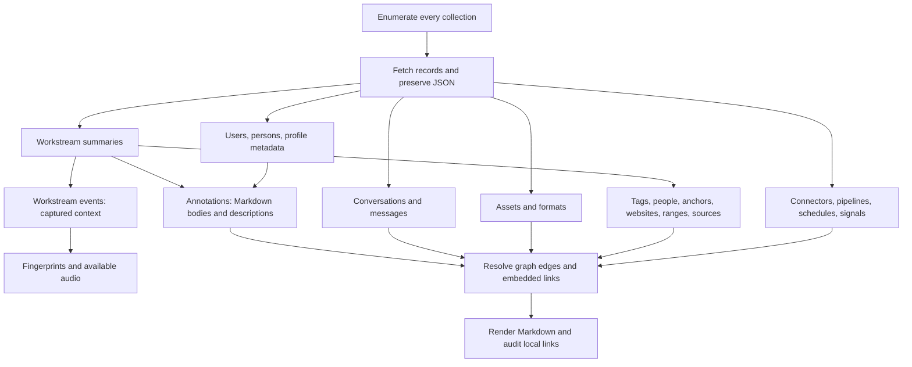

# Pieces OS data export: endpoints and traversal

Implementation status and the current filename/link/UX contract are maintained in [EXPORT_SPEC.md](EXPORT_SPEC.md) and [TODO.md](TODO.md). This document is the endpoint research reference; proposed layouts below are superseded by the spec.


Research date: 2026-09-28. This is the source-backed implementation guide for a migration/export application for the Pieces sunset. A first runnable Go CLI now exists; see [README](README.md) for implemented features, commands, and gaps. This guide also describes future work. Tests use a simulated OS; live-server compatibility has not yet been exercised.

The recommended export is **a raw JSON archive plus portable Markdown and recovered attachments**. Enumerate each collection independently, persist its IDs, fetch records in small batches, resolve relationships, and then render Markdown. Starting from summaries alone will miss standalone tags, events, conversations, annotations, and other unreferenced records.

That layout describes a **preservation export**, which can contain credentials and private browsing content. A **filtered export** must instead sanitize its JSON, Markdown, attachments, indexes, and reports together; it must not bundle original raw responses. See [privacy filtering research and proposed policy](PRIVACY_FILTERING.md) for local secret/PII detection, adult/banking domain categories, allow/deny rules, and treatment of derived summaries/personas.

The central pagination finding: **time-window enumeration is supported, but `POST /materials/identifiers` has no cursor or offset.** For small collections, obtain all IDs without a limit; for large histories, count and subdivide creation-time windows, fetching every ID in each window. Hydrate the saved IDs in client-side batches. Do not repeatedly request the first `limit` records and assume that advances through the database.

## Contents

- [Source baseline](#source-baseline)
- [Connection and compatibility](#connection-and-compatibility)
- [Enumeration and pagination](#enumeration-and-pagination)
- [Chronological export and readiness](#chronological-export-and-readiness)
- [How pieces_for_x and the SDK load data](#how-pieces_for_x-and-the-sdk-load-data)
- [Material endpoint inventory](#material-endpoint-inventory)
- [Content and relationship traversal](#content-and-relationship-traversal)
- [People, profiles, personas, and history](#people-profiles-personas-and-history)
- [Association endpoint inventory](#association-endpoint-inventory)
- [Markdown and attachment export](#markdown-and-attachment-export)
- [Completeness, recovery, and known gaps](#completeness-recovery-and-known-gaps)
- [Implementation sequence and acceptance checks](#implementation-sequence-and-acceptance-checks)
- [Privacy filtering research](PRIVACY_FILTERING.md)

## Source baseline

The package named `runtime_common_library` is available here inside `pieces-app/generated_runtime/sdk/http/dart/common`. The isomorphic server declares it as the `sdk/http/dart/common` package from **`open-runtime/generated_runtime`**. There was no standalone `open-runtime/runtime_common_library` checkout in this workspace. The server checkout is named `isomorphic_server`, with an underscore.

| Source | Revision inspected | Role |
| --- | --- | --- |
| [`open-runtime/generated_runtime`](https://github.com/open-runtime/generated_runtime/tree/076409253e6e7e362f8dac50728fbcfad4fb04fa) (local directory `../generated_runtime`) | `076409253e6e7e362f8dac50728fbcfad4fb04fa` | Common schemas, generated Dart models, HTTP contract |
| [`pieces-app/isomorphic_server`](https://github.com/pieces-app/isomorphic_server/tree/91ddc9a880f1275e20f7c939a2c890a07ebfb452) | `91ddc9a880f1275e20f7c939a2c890a07ebfb452` | Route registration, read handlers, batch behavior, filtering |
| [`pieces-app/os_server`](https://github.com/pieces-app/os_server/tree/c577f2046cb4477f7ed77ee5a5e054af5051c658) | `c577f2046cb4477f7ed77ee5a5e054af5051c658` | Mounted servers, discovery, authentication middleware |
| [`pieces-app/database_facade`](https://github.com/pieces-app/database_facade/tree/43ba1bd444f5944fa1af882e43761b56b31e3809) (local `../unified_monorepo/backend/database_facade`) | `43ba1bd444f5944fa1af882e43761b56b31e3809` | Actual temporal query semantics and person annotation queries |
| [`pieces-app/pieces_for_x`](https://github.com/pieces-app/pieces_for_x/tree/26f78367b66c1448c30c603579e542a760b9f94e) (local `../unified_monorepo/frontend/pieces_for_x`) | `26f78367b66c1448c30c603579e542a760b9f94e` | Desktop SDK initialization and dependencies |
| [`pieces-app/pieces_platform_client_sdk`](https://github.com/pieces-app/pieces_platform_client_sdk/tree/3583d73f2e5a97e10d7f3d348a546581ee888fcc) (local `../unified_monorepo/frontend/pieces_platform_client_sdk`) | `3583d73f2e5a97e10d7f3d348a546581ee888fcc` | Riverpod state, identifier streams, snapshot hydration, event cache, persona reads |
| [`pieces-app/pieces_platform_client_sdk`](https://github.com/pieces-app/pieces_platform_client_sdk/tree/ceb6dfdc6d0fe7a702c4e267825b0ab30b8a34ec) (local `../pieces_platform_client_sdk-personal-offer`) | `ceb6dfdc6d0fe7a702c4e267825b0ab30b8a34ec` | Confirmed embedded Markdown link syntax and parser tests |

These are independent checkouts, not a verified build lockfile. The generated-runtime working tree also contains unrelated checkout/billing changes; those were not changed or used as export evidence. The SDK/facade workspace checkouts have local dependency-file edits; the behavioral findings below come from source files at the recorded revisions. The older sibling `../database_facade` does not contain these filtered query implementations. Use the workspace paths above when following the temporal and SDK research.

Version drift is concrete: the workspace's isomorphic server at `6ac4a7dde66025dc4ddf06a44cf75b914fda79de` has 31 generic material handlers, while the endpoint inventory below uses sibling revision `91ddc9a…`, with 32 including `SCHEDULES`. Probe capabilities on the installed OS; do not assume these checkouts collectively describe one shipped build. [Workspace registry][workspace-registry].

Primary contract files:

- [HTTP paths: `spec/modules/core/isomorphic.openapi.yaml`][http-spec].
- [Models and parameters: `spec/common/runtime_common_library.yaml`][common-spec].
- [Generated common models][common-models]; inspect `toJson()` for actual wire keys. Dart names such as `materialType` serialize as `material_type`, while batch fields such as `workstreamSummaries` stay camelCase.
- [Material handler registry][registry]: the actual allowlist for generic enumeration, which is smaller than `MaterialNameEnum`.
- [OS route mounting][os-runtime]: a class or schema alone does not prove an endpoint is reachable.

When a contract comment and an implemented route disagree, this guide identifies the discrepancy. Verify against the target running version before shipping an adapter.

## Connection and compatibility

Use the local Pieces OS HTTP server, with an explicit base URL override. In the inspected build, production/staging uses ports **39300–39333**; debug uses **39334–39367**, with a debug environment override. OS persists its selected port in `.port.txt`. Prefer the installation's known port, then probe loopback candidates using `GET /.well-known/health` and `GET /.well-known/version`. Do not assume a process listening on the first port is the intended database. [Port selection][ports], [well-known endpoints][well-known], [OS startup][os-runtime].

Record the selected base URL, OS version, start/end timestamps, and export format version in the manifest. Health/version responses are probes, not collection inventories. The optional `application` request header is application context; it is not an export credential.

**Sunset dependency:** the inspected [authentication middleware][authentication] permits health/version without a signed-in user but gates most data reads on `getUserProfile()`. It can return `401` when the user is absent and custom status `593` when an OS update is required. It does not establish a generic bearer-token export flow. Test continued local read access after sign-out, session expiry, and loss of cloud services before the sunset release. An exporter cannot repair these server gates by retrying requests.

Use a declared read-endpoint allowlist. Some reads use POST; some GET endpoints have side effects. Exclude create/update/delete, associate/disassociate, regeneration, connector synchronization, backup restore, and token-refresh flows from the export path. Preserve existing content rather than regenerating it with an LLM.

## Enumeration and pagination

### 1. Inventory every supported material type

The shared read operations are:

| Method and path | Request | Response | Pagination |
| --- | --- | --- | --- |
| `POST /materials/metrics` | `MaterialMetricsRequest` | `MaterialMetricsResponse`, including `total_count` | Count only |
| `POST /materials/identifiers` | `MaterialIdentifiersRequest` | `MaterialIdentifiersResponse`, including `identifiers: string[]` | Optional `limit`; **no cursor/offset** |

Example full-inventory requests, with abbreviated responses:

```http
POST /materials/metrics
Content-Type: application/json

{"material_type":"WORKSTREAM_SUMMARIES"}
```

```json
{"material_type":"WORKSTREAM_SUMMARIES","total_count":1234}
```

```http
POST /materials/identifiers
Content-Type: application/json

{"material_type":"WORKSTREAM_SUMMARIES"}
```

```json
{"material_type":"WORKSTREAM_SUMMARIES","identifiers":["summary-id-1","summary-id-2"]}
```

Omit `limit` for the full collection. `limit: 0` returns an empty identifier list; it does not mean unlimited. A negative limit is rejected by the generic identifiers proxy. An enum member is not sufficient to use this endpoint: the registry currently has **32 handlers**, listed as `M` in the inventory below. In particular, `CONNECTORS`, observer records, and association enums are not registered. [Handlers and proxies][materials-server], [registry][registry], [default handler][default-handler].

There is an intentional request-shape difference for temporal filtering:

```json
{
  "material_type": "WORKSTREAM_EVENTS",
  "created": {
    "from": {"value": "2026-01-01T00:00:00Z"},
    "to": {"value": "2026-02-01T00:00:00Z"}
  }
}
```

For **identifiers**, `created`, `updated`, and `configurations` are top-level properties. For **metrics**, put the corresponding properties inside `filters`:

```json
{
  "material_type": "WORKSTREAM_EVENTS",
  "filters": {
    "created": {
      "from": {"value": "2026-01-01T00:00:00Z"},
      "to": {"value": "2026-02-01T00:00:00Z"}
    }
  }
}
```

Do not put the metrics `filters` wrapper in an identifier request; it is not read there. The generic default handler ignores domain configurations; workstream events have a specialized handler. For a full export, omit domain configurations and either omit temporal filters or exhaustively traverse the time windows described below. [Request models][common-spec], [proxies][materials-server].

### 2. Persist IDs, then fetch client-side pages

Save the complete deduplicated ID list before hydration. The implemented adaptive reader starts at **5 IDs**, uses **one outstanding data request**, and grows toward a ceiling of 50 while monitoring response latency/size. See [the performance specification](EXPORT_SPEC.md#output-destination-adaptive-reads-and-terminal-progress). The server's batch implementations use chunks of 50; `inBatch` takes a database write lock even for reads, so large parallel exports can disrupt ingestion. Fifty is an implementation-based recommendation, not a universal HTTP hard limit. [Server convention][server-agents], [event batch implementation][events-server].

```http
POST /workstream_summaries/batch?transferables=true
Content-Type: application/json

{"workstreamSummaries":{"iterable":[{"id":"summary-id-1"},{"id":"summary-id-2"}]}}
```

The corresponding response is shaped like:

```json
{
  "workstreamSummaries": {
    "iterable": [{"id":"summary-id-1","name":"Example","...":"other fields"}],
    "indices": {"summary-id-1":0}
  },
  "notFound": ["summary-id-2"]
}
```

The shortened object above illustrates the envelope, not a complete `WorkstreamSummary` fixture. Other key batch calls:

```http
POST /workstream_events/batch/fetch?transferables=true
Content-Type: application/json

{"workstreamEvents":{"iterable":[{"id":"event-id"}]}}
```

```http
POST /tags/batch/fetch?transferables=true
Content-Type: application/json

{"tags":{"iterable":[{"id":"tag-id"}]}}
```

Summary/event/tag batches accept IDs from `iterable[].id` and active `indices` entries. This is not universal: formats and several metadata batches read only `iterable`. **Always send `iterable: [{"id":"…"}]`** as the portable batch request shape, after normalizing discovered references client-side. Several handlers treat absent/malformed input as an empty batch, returning HTTP 200. Therefore an empty successful response to a nonempty request is a reconciliation error, not evidence that the collection was empty. Batch order is not a traversal cursor. [Summary batch][summaries-server], [event batch][events-server], [tag batch][tags-server], [format batches][formats-server].

For every batch, compare the **sets** of requested IDs, returned IDs, and reported missing IDs. Detect unaccounted-for and unexpected IDs. Persist records before checkpointing their completion. A `notFound` entry is not proof of deletion: summary/event handlers also place unexpected read failures in that list. Retry unresolved IDs individually using their singular read endpoint and retain the final HTTP status/error.

### 3. Do not manufacture pagination where none exists

| Surface | Actual traversal behavior |
| --- | --- |
| `POST /materials/identifiers` | All IDs if limit omitted; capped list otherwise. No continuation token. |
| `GET /workstream_summaries`, `/tags`, `/workstream_events`, and most other collection snapshots | Unpaginated snapshot; adding `page`, `offset`, or `cursor` does not implement paging. |
| `GET /workstream_events/identifiers` | All IDs if limit omitted; supports `limit`, `created_from`, `created_to`, `updated_from`, `updated_to`. No continuation token. Result is `FlattenedWorkstreamEvents`: IDs in `iterable`, intentionally empty `indices`. |
| `GET /conversations/identifiers` | Unpaginated `FlattenedConversations` identifier list. |
| `GET /assets/identifiers?pseudo=true` | Unpaginated `FlattenedAssets`; `pseudo` defaults false, so explicitly include pseudo records for an all-data inventory. `/assets` also has `pseudo`/`suggested` switches. Generic `ASSETS` enumeration is preferable to relying on a product-filtered snapshot. |
| `GET /activity/identifiers` | Specialized activity selection; supports pseudo/activity filtering. Prefer generic `ACTIVITIES` inventory for full coverage. |
| `POST /…/search`, `/materials/search/vector` | Ranked/filtered retrieval, not exhaustive enumeration. Key search implementations reject limits over 10,000 and have engine-specific defaults. |
| `GET /…/stream/identifiers` | WebSocket change feeds, sometimes with an initial snapshot. They are not paginated HTTP lists or durable export cursors. |

The workstream-event identifiers proxy silently ignores unparsable date values and invalid negative limits. Validate timestamps client-side; do not assume a typo produced an empty or bounded query. [Event identifiers][events-server], [asset IDs][assets-server], [conversation IDs][conversations-server].

### 4. Page large histories using counted time windows

**Yes: summaries, events, persons, and annotations can be enumerated through created/updated filters.** The generic handler forwards these to the collection facade. The inspected database implementation establishes the following semantics; verify the same behavior on supported OS versions. [Default handler][default-handler], [database filters][database-filters].

| Detail | Actual behavior |
| --- | --- |
| Bounds | Both inclusive: `timestamp >= from AND timestamp <= to`. Equal endpoints are allowed. One bound may be omitted. Inputs are normalized to UTC. |
| Two time dimensions | A created range **OR** an updated range, not AND. Use only one dimension per enumeration pass. |
| Ordering | Filtered IDs are ordered by `created.value DESC`, even for an updated-only query. No secondary ID sort/cursor is provided. |
| Limit | Caps that query's results. It cannot advance to another page. Omit it after making the window small enough. |
| What is being filtered | Record creation/update time, not a summary's covered `ranges` or a captured event's every contextual timestamp. |

The SDK uses the event-specific equivalent, with URL-encoded ISO timestamps:

```http
GET /workstream_events/identifiers?created_from=2026-01-01T00%3A00%3A00Z&created_to=2026-02-01T00%3A00%3A00Z
```

The generic JSON example above works for `WORKSTREAM_SUMMARIES`, `PERSONS`, or `ANNOTATIONS` by changing `material_type`. Do not add those filter parameters to ordinary collection snapshots and expect them to work.

Recommended exporter algorithm (the 5,000-ID target is a tunable client policy, not a server limit):

```text
inventory_window(type, from, to):
    count = materials_metrics(type, filters.created = [from, to])
    if count > 5000 and the interval has a representable interior timestamp:
        middle = timestamp strictly inside the interval
        inventory_window(type, from, middle)
        inventory_window(type, middle, to)
    else:
        ids = materials_identifiers(type, created = [from, to], limit omitted)
        save window bounds, count, complete response, and unique IDs
        reconcile count against IDs; record concurrent changes or failures
        add IDs to the global deduplicated inventory

hydrate each saved inventory in batches of 50
```

Start with bounded calendar windows suitable for the dataset, but explicitly cover both tails: a `to`-only query before the first boundary and a `from`-only query after the last boundary. If a tail is too large, extend the bounded window range and repeat the remaining tail. Do not choose an arbitrary product launch date as proof of the oldest record. Do not silently stop at `created <= now`: the SDK documents calendar events whose creation timestamps are their scheduled future start times. An all-data export must include those IDs too. [Event cache's time selection][sdk-event-cache].

Neighboring windows overlap at their inclusive boundary. Deduplicate IDs; do not sum window counts as if they were disjoint. Never advance by `last_timestamp + 1ms`: it can skip tied timestamps and assumes a precision the API does not promise. If one timestamp bucket is still too large, fetch it without a limit or report that a server cursor is needed. Time splitting cannot subdivide a tie.

An unfiltered ID audit is still the strongest check for records missing usable timestamps. Reconcile the window union against unfiltered IDs/counts, keeping missing IDs explicit. If the global list is too large to obtain and timestamp coverage cannot be verified, report that limitation. A matching count alone cannot prove the same ID set during concurrent writes.

After the initial pass, use **updated-only** overlapping windows covering the export interval to re-fetch changed records, including IDs already hydrated. Re-enumerate for additions/deletions as well. These calls have no snapshot token: a fixed time boundary is not an atomic database snapshot, and an updated pass can itself observe further changes.

### 5. Endpoints that really do paginate

**Website hostname helpers** use opt-in cursor pagination:

- `GET /websites/hostnames?limit=100` returns `hostnames` plus `pagination`.
- `POST /websites/hostnames/filter` with `{"hostname":"example.com","limit":100}` returns `websites` (flattened IDs) plus `pagination`.
- Repeat with the same limit and the previous `pagination.nextCursor`, in the query string for GET or JSON body for POST. Stop when `pagination.hasMore` is false. An omitted limit returns all results without pagination metadata.
- Treat the cursor as opaque. If `hasMore` is true but the cursor is missing/repeated, stop and report an error. The implementation restarts at the beginning if a cursor cannot be decoded or its key disappears; track progress to avoid an infinite loop.
- Hostnames are cached for up to 12 hours, and this is a hostname grouping surface. Use the complete `WEBSITES` inventory as the export authority, including records with unusable URLs.

[Website implementation][websites-server], [cursor helper][pagination-helper].

**Event/person association lists** use offset pagination:

- `GET /workstream_event_to_person_associations/person/{person}?limit=50&offset=0`
- `GET /workstream_event_to_person_associations/workstream_event/{event}?limit=50&offset=0`

They return `iterable`, `indices`, `limit`, `offset`, and `total`. The proxy defaults to limit 50, offset 0; clamps limit to 1–500; and normalizes negative offsets to 0. Advance by the applied page size and compare unique association IDs with `total`. An empty page before the expected total is a gap to investigate. Totals/offsets are not snapshot-consistent while associations change. [Implementation][event-person-server].

## Chronological export and readiness

**We have enough source information to implement a chronological export of the retained local data exposed by these APIs. We do not yet have evidence for an exhaustive, tested export of everything the user ever stored.** The Go implementation has fixture tests, live staging inventory/calibration/people previews, and bounded ASSETS/FORMATS exports; no full-history live export has completed. The [known gaps](#known-limitations-that-affect-the-sunset-plan) remain: inaccessible internal records/association metadata, stripped vectors, missing retained binaries/events, authentication/version dependencies, and concurrent changes. Cloud-only provider data is outside this local inventory unless already stored in OS; deleted history cannot be reconstructed from current snapshots.

Chronology should be a view over canonical records, independent of fetch order. The server often returns newest-created first, batches can complete out of order, and time-window enumeration only partitions the fetch. Sort the completed output explicitly.

| View / material | Chronological treatment |
| --- | --- |
| All-record inventory | Sort by valid `created.value` converted to a UTC instant, then material type and ID. Keep `updated.value` separately. This is record creation chronology, not necessarily when the underlying activity happened. |
| Ordinary workstream events | Use `created.value` as the documented fallback; retain contextual timestamps separately. Record the chosen `time_basis` rather than silently implying an exact capture time. |
| Calendar events | Retain `context.google_calendar.event.start/end.dateTime`, `date`, and `timeZone`. An activity view can use scheduled start/end, including future and all-day events. Do not turn a date-only event into an invented precise instant. |
| Summaries | Resolve `ranges` into `Range.from.value` / `to.value`. Display the covered interval independently of when the summary was generated or edited. Multiple ranges remain multiple intervals; do not imply coverage of gaps. |
| Conversation messages | Creation time supports the global timeline, while the transcript also respects the sequence/turn/order evidence described in the conversation section. |
| Persona/profile annotation history | Order versions by creation time, preserving update time. No historical version is inferred merely from a last-updated timestamp. |
| Persons, tags, assets, and other metadata | Include in the record chronology when dated and in their normal indexes regardless. A separate activity view can omit metadata creation noise without removing those records from the archive. |
| Absent/invalid timestamps | Put in an explicit undated index; preserve the source value and record the error. Never drop the record or silently substitute export time. |

Calendar/Range field names above are wire keys from the [common schemas][common-spec]; input models can use different keys. The semantic presentation choices in this table are proposed exporter policy, not an API guarantee about event time.

Recommended additional output:

```text
timeline/records.jsonl        # sorted references to every included dated record
timeline/activity.jsonl       # activity time/intervals with an explicit time_basis
markdown/days/YYYY-MM-DD.md   # chronological links to canonical material files
markdown/undated.md
```

Use a local disk-backed index or external merge sort for large exports. Each timeline entry should carry material type/ID, canonical path, original timestamp, normalized instant or date-only value, time basis, and any interval end. Keep date-only entries distinguishable from timed entries. Ties use a documented type/ID order for reproducibility; that order does not assert which event happened first.

Choose one display timezone for daily indexes and record its IANA name. Compute calendar-day boundaries in that timezone before converting query bounds to UTC; daylight-saving days are not always 24 hours. User-facing date selections can use half-open `[start, end)` semantics, while inclusive server queries deliberately overlap and the client applies the final selection. Do not subtract an assumed millisecond from the upper bound.

For an all-data export, include old, future, and undated records. For an optional date-limited export, distinguish **selected content** from referenced **context outside the selected range**, and declare whether such context is included, represented by a stub, or withheld. Apply privacy policy to both. Rebuild timeline/index entries from the final included graph so redacted titles and excluded records do not survive in a secondary index.

Before calling the exporter ready, complete a live read-only capability/count check, implement inventory/hydration/reconciliation, validate the chronology with equal timestamps and timezone transitions, and exercise the privacy cases in [the filtering plan](PRIVACY_FILTERING.md#validation-and-implementation-order). Those are implementation gates, not additional endpoints that have already been verified.

## How pieces_for_x and the SDK load data

The inspected desktop app depends on **`pieces_flutter_client_sdk` and `pieces_dart_client_sdk`** from `pieces_platform_client_sdk`. Its core connector initializes `PiecesFlutterClientSdk` with the shared Riverpod container and connector configuration. The useful architecture to study is desktop UI → SDK Riverpod notifiers/cache → generated repositories → OpenAPI HTTP/WebSocket client → Pieces OS. The exporter can use the same read endpoints directly without depending on Flutter or Riverpod. [Desktop dependencies][desktop-dependencies], [initialization][desktop-connector], [event repository][sdk-events-repository].

| SDK source / behavior | What it teaches the exporter |
| --- | --- |
| `PersonsNotifier`, `AnnotationsNotifier`, `WorkstreamSummariesNotifier` subscribe to plural `/…/stream/identifiers`. The shared identifier handler tracks created/updated timestamps and deletions, invalidating individual entity providers. | Inventory and full-record hydration are separate operations. A stream can supply change hints, but it has no verified durable replay cursor or cross-collection snapshot boundary. |
| Singular person/summary notifiers load SQLite state, compare freshness with identifier state, and call the singular snapshot repository when needed. | Hydrate by stable ID and checkpoint durable records. A cached UI value is not evidence that a fresh export fetched the server record. |
| `timeline_list_notifier.dart` processes summary IDs through singular providers in chunks of 25. It filters the visible list, including summary hierarchy children and summaries without annotations, with allowances for newly created items. | Do not export the visible timeline. Enumerate every summary, preserving children and body-less records. |
| `summary_rollup_annotation_notifier.dart` selects one annotation of type `SUMMARY` or `DEEP_STUDY_HIERARCHICAL_SUMMARY`. | Preserve all annotations; choosing a displayed narrative is a separate rendering decision. |
| `persona_notifier.dart` resolves the current user's person, then asks for one `HIERARCHICAL_PROFILE_SUMMARY` annotation and caches its trimmed text. | Follow the user → person → annotation mapping, but export all people, full annotation records, and retained versions. The cached string loses identity/provenance/history. |

Sources: [plural person state][sdk-persons], [plural annotation state][sdk-annotations], [plural summary state][sdk-summaries], [identifier stream handler][sdk-identifier-handler], [singular person][sdk-person], [singular summary][sdk-summary], [summary timeline][sdk-timeline], [rollup selection][sdk-rollup], [persona state][sdk-persona].

### The event loader is the closest example of time-window extraction

`EnrichedEventCacheService.getEventContext()` selects IDs using `workstreamEventsIdentifiersSnapshot(createdFrom, createdTo, limit)` and fetches missing records through `workstreamEventsBatch`. The summary configuration UI uses this cache for events since a selected time. That confirms the **time-filtered IDs → batched records** pattern is used by the product. [Event cache][sdk-event-cache], [summary configuration][sdk-summary-configuration].

Its cache policy serves interactive features, so the export should change these behaviors:

| Observed SDK policy | Export behavior |
| --- | --- |
| Startup backfill is 24 hours; polling normally runs every 5 minutes. Cache size is capped at 5,000 events, evicts old entries, and polling stops while full. | Traverse all time windows and preserve fetched records on disk; no age/count eviction during export. |
| Batch chunks are 500 IDs with up to 5 concurrent requests; `transferables: false`. | Start with five IDs, one outstanding request, and adapt toward at most 50 IDs; explicitly request transferables. The SDK's constants are not server limits. |
| Partially failed batches can return the successful subset; `notFound` is logged. | Reconcile every requested ID and retry unresolved reads. A partial result cannot advance a checkpoint for the missing IDs. |
| Enrichment filters by readable length (maximum 5,000) and content-quality rules. | Save every returned raw event before any readable projection; do not copy those filters. |
| IDs already present in the cache need not be re-fetched by `getEventContext`; a failed request can leave cached-only context. | Re-fetch changed records during an updated-time reconciliation pass and distinguish fresh responses from cached artifacts. |

[Cache and batch implementation][sdk-event-cache], [classification/filter pipeline][sdk-event-filter]. These are source observations at the pinned SDK revision, not benchmarked exporter settings. The reusable parts are the endpoint calls, identity handling, and separation of enumeration from hydration; the UI's cache contents and displayed lists are not a complete database inventory.

## Material endpoint inventory

All paths are relative to the selected OS base URL. `{id}` denotes a URL-encoded identifier.

`M` means that exact `material_type` is registered for `/materials/identifiers` and `/materials/metrics`. `S` means enumerate using a snapshot instead. `Gap` means identifiers can be found but an HTTP record read is missing. A batch field names both the input collection and, for the material batches below, the output collection. Batch calls are POST; collection and singular reads are GET unless explicitly stated.

### Main content and context records

| Material type / inventory | Collection read | Singular read | Batch read | Batch field |
| --- | --- | --- | --- | --- |
| `WORKSTREAM_SUMMARIES` — M | `/workstream_summaries` | `/workstream_summary/{id}` | `/workstream_summaries/batch` | `workstreamSummaries` |
| `WORKSTREAM_EVENTS` — M | `/workstream_events` | `/workstream_event/{id}` | `/workstream_events/batch/fetch` | `workstreamEvents` |
| `TAGS` — M | `/tags` | `/tag/{id}` | `/tags/batch/fetch` | `tags` |
| `ANNOTATIONS` — M | `/annotations` | `/annotation/{id}` | `/annotations/batch/fetch` | `annotations` |
| `CONVERSATIONS` — M | `/conversations` | `/conversation/{id}` | `/conversations/batch/fetch` | `conversations` |
| `CONVERSATION_MESSAGES` — M | `/messages` | `/message/{id}` | `/messages/batch/fetch` | `conversationMessages` |
| `ASSETS` — M | `/assets` | `/asset/{id}` | `/assets/batch/fetch` | `assets` |
| `FORMATS` — M | `/formats` | `/format/{id}` | `/formats/batch/fetch` | `formats` |
| `PERSONS` — M | `/persons` | `/person/{id}` | `/persons/batch/fetch` | `persons` |
| `ANCHORS` — M | `/anchors` | `/anchor/{id}` | `/anchors/batch/fetch` | `anchors` |
| `ANCHOR_POINTS` — M | `/anchor_points` | `/anchor_point/{id}` | `/anchor_points/batch/fetch` | `anchorPoints` |
| `WEBSITES` — M | `/websites` | `/website/{id}` | `/websites/batch/fetch` | `websites` |
| `RANGES` — M | `/ranges` | `/range/{id}` | `/ranges/batch/fetch` | `ranges` |
| `HINTS` — M | `/hints` | `/hint/{id}` | `/hints/batch/fetch` | `hints` |
| `WORKSTREAM_PATTERN_ENGINE_SOURCES` — M | `/workstream_pattern_engine/sources` | `/workstream_pattern_engine/source/{id}` | `/workstream_pattern_engine/sources/batch/fetch` | `identifiedWorkstreamPatternEngineSources` |
| `WORKSTREAM_PATTERN_ENGINE_SOURCE_WINDOWS` — M | `/workstream_pattern_engine/source_windows` | `/workstream_pattern_engine/source_window/{id}` | `/workstream_pattern_engine/source_windows/batch/fetch` | `workstreamPatternEngineSourceWindows` |
| `WORKSTREAM_PATTERN_ENGINE_OBSERVERS` — S | `/workstream_pattern_engine_observers` | `/workstream_pattern_engine_observer/{id}` | None exposed | — |
| `CONNECTORS` — S | `/connectors` | `/connector/{id}` | `/connectors/batch/fetch` | `connectors` |
| `PIPELINES` — M | `/pipelines` | `/pipeline/{id}` | `/pipelines/batch/fetch` | `pipelines` |
| `SCHEDULES` — M | `/schedules` | `/schedule/{id}` | `/schedules/batch/fetch` | `schedules` |
| `SIGNALS` — M | `/signals` | `/signal/{id}` | `/signals/batch/fetch` | `signals` |
| `FINGERPRINTS` — M | `/fingerprints` | `/fingerprint/{id}` | `/fingerprints/batch/fetch` | `fingerprints` |

These routes are backed by the corresponding singular/plural files in [isomorphic server `lib/`][server-lib] and the [HTTP contract][http-spec]. Preserve all standalone records even if no summary or asset refers to them.

### Additional stored metadata

| Material type / inventory | Collection read | Singular read | Batch read | Batch field |
| --- | --- | --- | --- | --- |
| `ACTIVITIES` — M | `/activities` | `/activity/{id}` | `/activities/batch/fetch` | `activities` |
| `APPLICATIONS` — M | `/applications` | `/applications/{id}` | None exposed | — |
| `DISTRIBUTIONS` — M | `/distributions` | `/distribution/{id}` | `/distributions/batch/fetch` | `distributions` |
| `ENTITIES` — M | `/entities` | `/entity/{id}` | `/entities/batch/fetch` | `entities` |
| `MODELS` — M | `/models` | `/model/{id}` | `/models/batch/fetch` | `models` |
| `RELATIONSHIPS` — M | `/relationships` | `/relationship/{id}` | None exposed | — |
| `SENSITIVES` — M | `/sensitives` | `/sensitive/{id}` | `/sensitives/batch/fetch` | `sensitives` |
| `SHARES` — M | `/shares` | `/share/{id}`; also `/shares/{id}` | `/shares/batch/fetch` | `shares` |
| `SUBSCRIPTIONS` — M | `/subscriptions` | `/subscription/{id}` | `/subscriptions/batch/fetch` | `subscriptions` |
| `USERS` — M | `/users` | No generic `/user/{id}` snapshot; `/user` is current-user context | `/users/batch/fetch` | `users` |
| `ALLOCATIONS` — M | `/allocations` | `/allocation/{id}` | None exposed | — |
| `INTERNAL_SUMMARY_REPORTS` — M, Gap | No exposed read | No exposed read | None exposed | — |

Shares and allocations inherit routes from [server base classes][server-lib] and are implemented/mounted by OS. Internal summary report classes explicitly expose no endpoints, despite their registry entries. Model metadata does not export model-weight downloads; share metadata does not archive an external hosted page. User/account metadata and `SENSITIVES` are separate records, not replacements for the underlying content.

### Other read surfaces worth accounting for

| Endpoint | What it adds / limitation |
| --- | --- |
| `GET /user` | Current-user wrapper/context; preserve separately from `/users` profiles. |
| `GET /os/settings` | `OSServerSettings` snapshot; save as configuration JSON outside the material inventory. No pagination. Implemented by OS, not the isomorphic material servers. |
| `GET /user/{user}/person` | Active person associated with a user. |
| `POST /person/{person}/annotations` and `POST /user/{user}/annotations` | JSON `filter` supports types and created/updated ranges; no continuation cursor. `{}` defaults to **100 records**, excluding `UNKNOWN` and `COMPACTION`. Use global `ANNOTATIONS` inventory for completeness. |
| `GET /conversation/{id}/messages` | Messages reached through that conversation's active message indices; no pagination. Global message enumeration catches omissions/orphans. |
| `GET /asset/{id}/conversations`, `GET /asset/{id}/activities` | Supplemental asset context. Global collections remain the inventory authority. |
| `GET /format/{id}/analysis` | Per-format analysis. |
| `GET /analyses` | Collection snapshot, no generic material handler. |
| `POST /code_analyses`, `POST /image_analyses`, `POST /ocr_analysis` | Implemented snapshot reads, with no request body consumed by these proxies. The inspected HTTP spec describes GET for code/image analysis; use a version-specific adapter and verify this discrepancy. |
| `GET /metrics/formats`, `GET /metrics/formats/ordered` | Format metrics views, not the full contents of formats/files. |
| `GET /fingerprint/{id}/audio?download=true` | Stored OGG bytes; `200` is binary `audio/ogg`, `410` means no fingerprint/stored audio. Save as an attachment and record unavailable audio explicitly. |
| `GET /workstream_pattern_engine/processors/vision/data/events` and `…/events/{id}` | Legacy vision projection of events, with optional transferable OCR text. Not a substitute for full workstream events or a screenshot archive. |

For configuration preservation, also record `GET /workstream_pattern_engine/processors/audio/devices/preferences`, `GET /workstream_pattern_engine/processors/vision/calibrations`, and `GET /workstream_pattern_engine/processors/sources`. These are configuration/runtime views, distinct from persisted `/workstream_pattern_engine/sources` material records. Do not call the corresponding update or capture-control routes. [OS settings][os-server], [processor endpoints][wpe-server].

Fingerprint candidate routes (`GET /fingerprints/candidates`, `GET /fingerprint/{id}/candidates`) and event/person source counts (`GET /workstream_event_to_person_associations/person/{id}/source_type_counts`) are derived inspection views. They are useful for diagnostics, not primary content enumeration. Processor status, application discovery, search recommendations, health streams, inference endpoints, and cloud backup listings similarly do not replace stored-content reads.

The remaining non-association enum families do not imply additional generic read APIs: `CURRENT_USERS` is represented by current-user context; `FILES` and `FRAGMENTS` require preserving the content exposed through formats/messages; `FORMAT_METRICS` has the views above; analysis families have the specialized snapshots above. `UNKNOWN` is not a collection. Record internal data not covered by these projections as unavailable rather than inventing paths from enum names.

### Transferables and projection rules

- Pass **`?transferables=true`** on material batch reads when exporting content. Many batch proxies default it to false; many ordinary snapshot proxies default to true. Explicit parameters prevent differences between versions from silently discarding content.
- **`GET /format/{id}` uses singular `?transferable=true`**. `/formats/batch/fetch` uses plural `transferables`. [Format proxy][format-server], [query helper][query-helper].
- `transferables=true` can populate nested `reference` data/content, but it is not a promise to return the whole object graph or every internal field. Fetch each referenced entity from its canonical collection.
- Several proxies explicitly strip embedding vectors, including summary/event batch responses. Preserve returned fields, but mark embeddings as outside the available HTTP export rather than pretending empty vectors reproduce the database.
- Do not invent a generic `relationships=true` query parameter. Tag/asset/format proxies pass an internal `relationships: false` argument; relation tables and explicit reference traversal need separate handling.
- Collection `indices` are mappings from IDs to positions/status, not page numbers. A value **`>= 0` is active**, including zero; negative values represent removed references. Preserve the original maps, but exclude negative references from active navigation. An `iterable` entry can contain only `{id}` or an optional `reference` projection.
- When `iterable` and `indices` disagree, log the discrepancy. Build the active union of IDs while giving an explicit negative index precedence; keep the original response for later inspection. Do not drop an `iterable` just because its `indices` is empty (event identifier responses deliberately work this way).

## Content and relationship traversal



This diagram shows export dependencies, not every possible edge. Implement a typed queue keyed by `(material_type, id)` with a visited set. A material can have many parents, back-references, and cycles; never recursively serialize every nested reference without deduplication.

### Workstream summaries and their Markdown

1. Enumerate **all** `WORKSTREAM_SUMMARIES` via materials identifiers, then fetch `/workstream_summaries/batch?transferables=true`.
2. Preserve `name`, timestamps, favorite/phase/mechanism data, model metadata, ranges, and every relationship collection.
3. Resolve `summary.annotations` via `/annotations/batch/fetch?transferables=true`. The Markdown body is **`Annotation.text`**, usually on an annotation of type **`SUMMARY`**. The inspected SDK also displays `DEEP_STUDY_HIERARCHICAL_SUMMARY` in its rollup selector. Preserve the other hierarchical summary types too. A `DESCRIPTION` annotation is separate; the summary name/description is not the full narrative.
4. Export every attached annotation, including multiple SUMMARY annotations and profile/persona annotations. For a single primary body, define a deterministic exporter policy (for example newest `updated.value`, then ID), and record the selected annotation ID. This is an exporter policy, not a guaranteed server ordering contract.
5. Follow `events`, `tags`, `persons`, `websites`, `anchors`, `assets`, `conversations`, `messages`, `messageRoot`, `ranges`, `sources`, `hints`, `summaries`, `connectors`, `pipelines`, and `signals`. Archive embedded application/model metadata too.
6. Fetch hierarchy metadata separately; the summary batch implementation does not request it.

The common [WorkstreamSummary/Annotation schemas][common-spec] establish these fields. Compare the [SDK rollup selector][sdk-rollup] with the older [summary export helper][summary-export-helper], which only selects a `SUMMARY` annotation. Do not reuse that helper as an all-data exporter: it exports one annotation's text.

Hierarchy endpoints:

| Read | Meaning |
| --- | --- |
| `GET /workstream_summary/{id}?transferables=true&association_metadata=true` | Source implementation requests immediate `parents`/`children`; the installed staging response still omitted them. Presence of `association_metadata` enables the source branch, even if its value is `false`. Do not rely on this as the sole hierarchy traversal. |
| `GET /workstream_summary/{id}/parent/identifiers` | Immediate parents, one level only. |
| `GET /workstream_summary/{id}/child/identifiers` | Immediate children, one level only. |
| `GET /workstream_summaries/parent/identifiers` | All IDs participating as parents anywhere; not just hierarchy roots. |
| `GET /workstream_summaries/child/identifiers` | All IDs participating as children anywhere; not the descendants of one requested summary. |

These return flattened summary references. Compute roots only after comparing all summary IDs and edges; preserve unparented summaries and general `summaries` relationships too. Use a visited set to traverse descendants. The global parent/child helpers can swallow errors and return empty results; per-summary helpers can skip association read errors. Empty hierarchy results alone do not prove that no hierarchy exists. [Summary reads][summary-server], [global hierarchy helpers][summaries-server].

### Summary classification and relationship coverage

The deeper schema/SDK review separates **classification**, **attachment**, **identity**, and **hierarchy**. They are independent data:

| Evidence | Meaning and exporter traversal |
| --- | --- |
| `WorkstreamSummary.parentHierarchicalType` | Broad type: UNKNOWN, GENERIC, QUERY_DRIVEN, DEEP_STUDY, CONVERSATIONALLY_GENERATED, TEMPORAL_DAY/WEEK/MONTH/QUARTER/YEAR, or SPECIFIC hierarchical summary. It does not identify a person or annotation body. |
| `WorkstreamSummary.parentHierarchicalTypeDescriptor` | Finer single-click/pipeline classification. The pipeline options schema explicitly says the client uses this to filter a pipeline's summaries. The SDK has exact keys for `standup`, `morning_brief`, `end_of_day_recap`, `week_recap`, `todays_headlines`, `persona`, `custom_summary`, `temporal`, `collaboration_patterns`, `ai_habits`, `top_of_mind`, `time_tracker`, and `meeting_prep`. |
| `Annotation.type = HIERARCHICAL_PROFILE_SUMMARY` | Generated persona text, distinct from the workstream-summary hierarchy enum. Query all retained versions through person annotations. |
| `Annotation.type = PROFILE_DESCRIPTION` | Factual bio/about-me text; not a summary generation type. |
| `summary.annotations` / `annotation.summaries` | Forward or reverse attachment supplies actual `Annotation.text`. The exporter now reconciles both directions, marks derived inverses, and applies privacy propagation to the attachment. |
| `person.annotations` / `annotation.persons` / legacy `annotation.person` | Persona/profile ownership path. Projected person snapshots are supplemented by the read-only person annotations query. |
| Persona annotation → `summaries` | Workstream summaries associated with that version of the persona. Render as profile-context links. The server's summary creation code attaches the author's latest persona/profile annotation, so this edge alone does not prove that the whole workstream summary describes the person. |
| `person.summaries` / `summary.persons` | Direct involvement/author relation. The association model also has an `author` boolean, but the current exporter does not enumerate its full metadata. Keep this distinct from a prose mention or profile-context relationship. |
| `GET /user/<user>/person` | Exact User ID → Person ID mapping; use it for users/ placement. Never assume IDs are interchangeable or equate all platform persons with the end user. |
| `summary.pipelines` / `pipeline.summaries` | Explicit pipeline membership, separate from descriptor classification. Either direction supplies a secondary index. |
| Global parent IDs → each parent's child IDs | Immediate hierarchy edges. All global parents include intermediate nodes, so this can reconstruct multiple levels without recursion or a snapshot request per summary. Preserve multiple parents. |

Sources: [common schema](../generated_runtime/spec/common/runtime_common_library.yaml), [SDK generation enum](../unified_monorepo/frontend/pieces_platform_client_sdk/packages/pieces_dart_client_sdk/lib/src/utils/enums/workstream_summary_generation_type.dart), [summary creation and author annotations](../isomorphic_server/lib/workstream_summaries_internal_server.dart), [person reads](../isomorphic_server/lib/person_internal_server.dart), [user-to-person endpoint](../isomorphic_server/lib/user_internal_server.dart), [custom pipeline descriptor construction](../isomorphic_server/lib/utils/pipeline_stream_handler/custom_pipelines/custom_pipeline_resolver.dart).

`custom_pipeline_<record.id>` is emitted by the server for a custom pipeline; no title heuristic is needed to classify that output. The implementation uses an included pipeline's approved display name for the folder label, retaining a descriptor hash suffix to separate same-name pipelines. Missing/excluded pipelines keep the descriptor fallback. This is a display lookup, not an invented typed association. A `persona` pipeline descriptor is not interchangeable with `HIERARCHICAL_PROFILE_SUMMARY` or evidence of exclusive person ownership. See the exact placement contract in [EXPORT_LAYOUT.md](EXPORT_LAYOUT.md).

**Implemented hierarchy read sequence:**

1. Inventory all summary IDs independently of hierarchy participation.
2. Read `GET /workstream_summaries/parent/identifiers?transferables=false` and its child equivalent.
3. For each returned parent, read `/workstream_summary/<parent>/child/identifiers?transferables=false`.
4. Deduplicate edges and retain parent/child navigation in both directions. Validate collection shape rather than accepting a missing field as an empty collection.
5. Compare distinct recovered children with the global child inventory; missing, unexpected, self, malformed, or failed results become coverage issues. Report parents read and edge counts in the manifest.

This costs **2 + number-of-parents** hierarchy reads instead of another singular snapshot for every summary. It does not recover general non-hierarchical `summaries` edges or association metadata. Global helpers can catch internal errors and return empty; per-parent helpers can skip failed association reads. Matching their returned sets is a consistency check, not a database-level proof of completeness.

**Observed on 2026-09-29, staging 12.6.29-staging:** the implemented read-only traversal found 11,733 summary IDs, 20 parents, 1,004 children, and 1,708 direct edges. All 20 parent reads succeeded, the child sets matched, and there were zero coverage issues/retries/backoffs. The approximately 0.10-second probe measured 25 requests before final health checks and recent HTTP p95 about 14 ms. These are hierarchy timings, not export throughput; the OS remained healthy.

An earlier attempted structural scan stopped safely after 10,475 summaries on repeated slow reads. It was not a full-history export. A later evenly spaced 250-summary sample exposed hierarchy type on every record and descriptors on five: 245 UNKNOWN and five SPECIFIC summaries. One descriptor was `standup`; other custom values were not logged. None of those records exposed annotations, persons, pipelines, summaries, parents, children, events, tags, signals, ranges, sources, or websites. Direct persona annotation queries and annotation batch reads exposed text/types but also omitted their summary relationships. Samples were aggregated without printing bodies, identities, names, or private URLs.

**Remaining API gap:** models contain `WorkstreamSummaryToPersonAssociation` and `PipelineToWorkstreamSummaryAssociation`, but a model's existence is not an enumeration endpoint. The inspected server has no summary-to-person association enumeration route. [Pipeline association reads](../isomorphic_server/lib/pipeline_to_workstream_summary_associations_internal_server.dart) offer an exact known pair and a batch of known association IDs, not a complete membership listing. Brute-force testing every person/summary or pipeline/summary pair is not an appropriate export strategy. The generic `RELATIONSHIPS` node enum only supports ASSET, FORMAT, TAG, and WEBSITE, so it cannot rebuild these memory edges. Streamed identifiers report changes rather than a full historical association snapshot.

To close the release blocker, obtain a supported server response that includes active relationship IDs on at least one side, or provide a read-only, paginated association enumeration API with verifiable totals. Then test forward/reverse consistency and compare summary bodies/person memberships/pipeline memberships against a known reference dataset. Do not generate/regenerate or mutate associations to manufacture missing history. Independently exporting annotation text preserves exposed records but does not prove attachment to the correct summary.

### Tags, people, annotations, and source context

Export all `TAGS`, not just tags attached to summaries. Preserve text, category, source, timestamps, `mechanisms`, and linked materials. Tags are shared entities; do not collapse distinct IDs with identical text into one tag during preservation. Render a tag page with backlinks to exported objects.

Export all `PERSONS` and their attached annotations as detailed below. `ANCHORS` and `ANCHOR_POINTS` preserve file/location references, while `WEBSITES` preserve URL metadata. A stored anchor or website is not proof that the file bytes or web page were captured.

Preserve `RANGES` independently: a summary's creation time is not necessarily its covered activity range. Resolve identified workstream sources and source windows using the paths in the inventory; the plural batch JSON names are longer than the URL segments.

### People, profiles, personas, and history

There is no separate persona collection to enumerate in this contract. **The person is the graph entity; persona/profile prose lives in annotations.** Account profiles are another record type and need their own inventory.

| Data | Storage / read path | Export treatment |
| --- | --- | --- |
| All people, including extracted/contextual people | `PERSONS` → `/persons/batch/fetch`; singular `/person/{id}` | One canonical `persons/{id}.md` plus raw JSON per ID. Keep ghost/extraction metadata and disconnected persons. |
| User/account profile | `USERS` → `/users/batch/fetch`; `/user` for current-user context | Separate `users/{id}.md` and raw JSON; preserve the mapping to a person. |
| User → person mapping | `GET /user/{user}/person` | Read the returned person's ID. Never assume the account user ID equals the person ID. A missing mapping is a recorded gap. |
| Generated persona | `Annotation.type == HIERARCHICAL_PROFILE_SUMMARY` | Preserve full `text`, ID, timestamps, model/mechanism data, related people, and evidence references for every retained version. |
| Profile / “about me” description | `Annotation.type == PROFILE_DESCRIPTION` | Preserve separately from generated persona text, including retained versions. |
| Supporting annotation data | All other types, including `COMPACTION`, summary variants, descriptions, and comments | Archive globally without a UI type filter. Keep type distinctions rather than collapsing everything to a persona string. |

`Person.type` can contain `basic` identity data (such as name, username, picture, email, URL, and sourced information) and/or `platform` user-profile data. Preserve both as returned. `Person.extraction` records fields such as aliases, emails, dominant role, last-seen time, and evidence types; preserve any inferred attributes with their original confidence/provenance. Keep `ghost` and links to other persons. Names/emails are descriptive fields, not safe deduplication keys. [Person, UserProfile, PersonExtractionProfile, and Annotation schemas][common-spec].

For comparison, this is the current-persona lookup used by the SDK after resolving the user's person:

```http
POST /person/person-id/annotations
Content-Type: application/json

{"filter":{"types":["HIERARCHICAL_PROFILE_SUMMARY"]},"limit":1}
```

The response has `person` and `annotations` (with `iterable`/`indices`), sorted by annotation creation time descending. Use `PROFILE_DESCRIPTION` for the corresponding profile text. These queries are useful cross-checks for the newest displayed text; `limit: 1` does not export the history. The server's regeneration path creates a new persona annotation to retain earlier versions. The exporter reads those versions and never invokes generate/regenerate routes. [Person annotations and persona implementation][person-server], [SDK persona lookup][sdk-persona].

Both person/user annotation endpoints accept `filter.types`, `filter.created`, and `filter.updated`; the temporal fields use the same nested `from`/`to` timestamp objects as the generic requests. They have **no cursor and no unlimited mode obtained by omitting `limit`**: the default is 100. An absent/empty type filter excludes `UNKNOWN` and `COMPACTION`; the latter can be explicitly requested. Within the database query, created/updated ranges are inclusive and combined with OR, while the person/type constraints are ANDed. [Server defaults][person-server], [person annotation query][person-annotation-query], [user delegation][user-server].

For complete history, inventory **all `ANNOTATIONS`** independently, using generic time windows if necessary. Reconcile `person.annotations`, active `annotation.persons` references, and the legacy singular `annotation.person` field. The inspected per-person database query checks `persons.indices.<person-id> >= 0`; it cannot by itself recover legacy-only, orphaned, or inconsistent relationships. Preserve such records and flag disagreements instead of discarding them.

On the person's Markdown page, link to the latest persona and profile description and list all other versions by timestamp. Matching the server's latest choice means sorting by `created.value DESC`; break ties by ID as an explicit exporter policy because the server does not specify tie order. The canonical annotation page keeps the original full text and links back to every referenced person, summary, event, or other material. A readable excerpt on the person page is optional; it must not replace the annotation record or invent a version lineage not present in the data.

### Installed-OS projection compatibility and person selection (2026-09-29)

On staging `12.6.29-staging`, both `/persons/batch/fetch` and `/person/<id>?transferables=true&association_metadata=true` omitted embedded annotation, summary, and event relationships. Absence is **unknown coverage**, not an empty person graph. The first zero-persona preview based only on those fields was invalid and has been superseded by direct query evidence.

Implemented additional read surfaces:

| Endpoint | Export use and limits |
| --- | --- |
| `GET /user` | Current account record wrapper; never log its contents/credentials. |
| `GET /user/<user-id>/person` | Read-only account-to-person mapping; 404 can mean absent. Never assume equal IDs or invoke create/update to establish it. |
| `POST /person/<person-id>/annotations` | Body `{"filter":{"types":["HIERARCHICAL_PROFILE_SUMMARY"]},"limit":50}`; substitute `PROFILE_DESCRIPTION` for about-me text. Preview uses limit 1. Response has person plus annotations. Full history follows inclusive `filter.created.to.value`, deduplicates IDs, and checks progress. Dense timestamp ties can saturate this non-cursor endpoint; report incomplete history rather than subtracting time and skipping records. Global annotation inventory remains independent. |
| `GET /workstream_event_to_person_associations/person/<person-id>?limit=1&offset=0&transferables=false` | Read `total` as source event-association count while fetching one row. Source accepts bounded offset/limit (limit at most 500); no need to load all event bodies to estimate connectivity. |

Sources: [person server](../isomorphic_server/lib/person_internal_server.dart), [user mapping](../isomorphic_server/lib/user_internal_server.dart), [indexed event-person associations](../isomorphic_server/lib/workstream_event_to_person_associations_internal_server.dart). Export never invokes persona generation/regeneration or association mutations.

The corrected live preview evaluated 4,291 persons: 1,373 with persona annotations, zero separate profile descriptions, six account identities already among the retained people. Explicit `--people profiles` can omit 2,918 (68.0%) before privacy filtering. `connected` retains unknown summary connectivity conservatively; it currently retains all 4,291 despite 3,720 having at least ten event associations. Source event totals are not privacy-qualified retained-content counts.

Names and extraction aliases are insufficient identity proof. Only matching explicit platform user IDs group navigation, with separate canonical records preserved. Shared explicit emails/full names form review candidates only. See [folder and naming contract](EXPORT_LAYOUT.md) for profile/history/summary folders, selection modes, and source-coverage caveats. Ordinary temporal/deep-study hierarchical workstream summaries are not persona annotations.

### Workstream events and captured content

Enumerate all `WORKSTREAM_EVENTS` (generic IDs or unbounded `/workstream_events/identifiers`), not just summary-linked events. Fetch the full records in batches with transferables enabled.

The [event/context schemas][common-spec] contain several kinds of content. The paths below use **wire JSON keys**, which mix camelCase and snake_case:

| Field | Markdown/export treatment |
| --- | --- |
| `readable`, `title`, `description`, `windowTitle`, `browserUrl` | Human-readable event context; retain exact values alongside rendered text. |
| `context.native_ocr.ocrText` | Captured OCR text, with app/window/browser metadata. Do not treat it as an image file. |
| `context.native_clipboard.content.text`, `.html`, `.rtf` | Preserve every provided representation; render text, save HTML/RTF separately when present. |
| `context.native_audio.content.text` | Transcript text in the inspected common schema; not a recording download. |
| `context.native_browser` | Browser URL/visit metadata. |
| `context.google_calendar`, `context.ide`, `context.browser`, `context.accessibility` | Preserve the complete returned objects, even if the first renderer only offers a generic context section. |

Follow summaries, tags, sources, source windows (`source_windows`), messages, annotations, anchors, websites, people, hints, connectors, fingerprints, and signals. Fetch available fingerprint audio separately. Never reduce the archive to `readable` alone: event context can carry additional text and metadata. Unknown fields from newer OS builds must survive raw JSON storage even if an older generated SDK omits them on reserialization.

### Conversations and messages

Enumerate both `CONVERSATIONS` and `CONVERSATION_MESSAGES`. Use the global message list to catch messages absent from a conversation's index. `/conversation/{id}/messages` follows that index and fails if a referenced message cannot be loaded; it is not a stronger completeness guarantee.

Render a transcript with message ID anchors, role, timestamp, model, content from **`fragment.string.raw`** (or the supplied alternative representation), and associated context. Preserve `sequence`, `turn_id` (Dart `turnId`), message links, `summaryRoot`, usage, and agent/tool structures when present. Message/tag/annotation event references use the JSON key `workstream_events`, while the batch request key is `workstreamEvents`. Keep tool messages and empty/nontext messages in the JSON archive.

Preserve both the conversation's `messages.indices` ordering and per-message ordering fields. The inspected per-conversation HTTP read iterates the index map without explicitly sorting it. Define and test transcript ordering against real fixtures; use valid sequence data where available, then timestamp/ID as a deterministic fallback, recording conflicts instead of silently rearranging history. [Conversation server][conversation-server], [message server][messages-server].

### Saved materials, formats, and binaries

Enumerate `ASSETS` and `FORMATS` independently. Fetch asset data and then every referenced format, including **`asset.original.id`**, preview formats, and alternatives. Export original content as well as previews; a preview may be shortened or transformed.

`Format.fragment` and `Format.file` can contain `TransferableString` and `TransferableBytes`. Write `bytes.raw` as bytes, not as a JSON string or UTF-8 text. Decode `string.base64`, `string.base64_url`, or `string.data_url` only when actually supplied and supported by that representation. The common schema marks the alternate `TransferableBytes` encodings as unimplemented; do not assume their array-valued fields are conventional base64 strings. Preserve undecodable payloads and record the failure.

For text/code, create a Markdown page and a separate original-content file. Choose a fence longer than any backtick run in the content; use the stored classification as an optional language hint. For images and other files, create a metadata page linking to recovered bytes. Record original names, classification/MIME information where available, sizes, and checksums.

`GET /asset/{id}/export?export_type=MD` is a convenience formatter, returning `ExportedAsset` with `raw: FileFormat`; it is not a complete archive. It can fall back to a preview or `Content Preview not supported`; HTML export currently throws. Prefer rendering from the preserved asset/formats. [Asset export implementation][asset-server], [format proxy][format-server], [transferable schemas][common-spec].

## Association endpoint inventory

Relationships have two layers: references on material records and separate association objects with provenance/metadata. Preserve both where the API exposes them. Do not confuse a material ID with the ID of an association.

The following families have **GET pair lookup** and **POST batch fetch** in the inspected server. For each row, the pair URL is `/<family>/<pair suffix>` and the batch URL is `/<family>/batch/fetch`. This table lists all 23 exposed association server families found in the inspected `lib/` tree. [Implementations][server-lib], [contract][http-spec].

| Family | Pair suffix after the family |
| --- | --- |
| `connector_to_annotation_associations` | `connector/{connector}/annotation/{annotation}` |
| `connector_to_conversation_associations` | `connector/{connector}/conversation/{conversation}` |
| `connector_to_conversation_message_associations` | `connector/{connector}/message/{message}` |
| `connector_to_person_associations` | `connector/{connector}/person/{person}` |
| `connector_to_website_associations` | `connector/{connector}/website/{website}` |
| `connector_to_workstream_event_associations` | `connector/{connector}/workstream_event/{event}` |
| `connector_to_workstream_summary_associations` | `connector/{connector}/workstream_summary/{summary}` |
| `fingerprint_to_person_associations` | `fingerprint/{fingerprint}/person/{person}` |
| `fingerprint_to_workstream_event_associations` | `fingerprint/{fingerprint}/workstream_event/{event}` |
| `pipeline_to_connector_associations` | `pipeline/{pipeline}/connector/{connector}` |
| `pipeline_to_range_associations` | `pipeline/{pipeline}/range/{range}` |
| `pipeline_to_schedule_associations` | `pipeline/{pipeline}/schedule/{schedule}` |
| `pipeline_to_signal_associations` | `pipeline/{pipeline}/signal/{signal}` |
| `pipeline_to_website_associations` | `pipeline/{pipeline}/website/{website}` |
| `pipeline_to_workstream_pattern_engine_source_associations` | `pipeline/{pipeline}/source/{source}` |
| `pipeline_to_workstream_summary_associations` | `pipeline/{pipeline}/workstream_summary/{summary}` |
| `signal_to_annotation_associations` | `signal/{signal}/annotation/{annotation}` |
| `signal_to_person_associations` | `signal/{signal}/person/{person}` |
| `signal_to_range_associations` | `signal/{signal}/range/{range}` |
| `signal_to_website_associations` | `signal/{signal}/website/{website}` |
| `signal_to_workstream_event_associations` | `signal/{signal}/workstream_event/{event}` |
| `signal_to_workstream_summary_associations` | `signal/{signal}/workstream_summary/{summary}` |
| `workstream_event_to_person_associations` | `workstream_event/{event}/person/{person}` |

Example:

```http
GET /connector_to_annotation_associations/connector/connector-id/annotation/annotation-id
```

Once actual association IDs are known:

```http
POST /connector_to_annotation_associations/batch/fetch?transferables=true
Content-Type: application/json

{"associations":{"iterable":[{"id":"association-id"}]}}
```

Association batch envelopes differ from ordinary material batches: they use `associations`, and their `notFound` is a **flattened association collection** (`iterable`/`indices`), rather than the material batches' string array. Parse the endpoint-specific schema. [Representative connector association implementation][connector-annotation-server].

These families have no universal global association-ID enumeration endpoint, and they are not registered in the generic material registry. Discover pairs from both ends of active material relationships, call the pair lookup, and archive the returned association ID/data. Use the offset-paginated event/person lists for that family. Do not invent deterministic association IDs in the exporter or attempt a Cartesian product of all materials.

For event/person associations, preserve `role`, `confidence`, `evidence_type`, `source_type`, and `explanation` in addition to the IDs and timestamps. Losing this object loses why the person was associated with an event. [Association model][common-spec], [event/person reads][event-person-server].

**Coverage limit:** pair discovery cannot prove recovery of orphan association records whose endpoint relationships are missing. Other association models exist without corresponding exposed read servers here, including summary-to-summary and several hint-related associations. Summary hierarchy reads recover parent/child edges, but not necessarily the original association record's complete metadata. The `RELATIONSHIPS` collection is not a universal replacement for these typed associations. A truly complete database migration needs a server read surface or database-level export for these gaps.

## Markdown and attachment export

### Earlier archive sketch (superseded by format 4)

The implemented layout is in [EXPORT_LAYOUT.md](EXPORT_LAYOUT.md): person profile/history folders, pipeline-specific summary folders, and a timeline with explicit unknown-type handling. The sketch below is retained only as the original source-research model, not the current path contract.

This layout is an exporter design, not an existing server response format:

```text
pieces-export/
  README.md
  manifest.json
  inventory/                 # saved IDs, counts, checkpoint state
  raw/
    workstream_summaries/<id>.json
    workstream_events/<id>.json
    annotations/<id>.json
    <material-type>/<id>.json
    associations/<family>/<id>.json
  markdown/
    index.md
    summaries/<id>.md
    events/<id>.md
    conversations/<id>.md
    messages/<id>.md
    assets/<id>.md
    annotations/<id>.md
    persons/<id>.md
    users/<id>.md
    tags/<id>.md
    anchors/<id>.md
    <other-material-type>/<id>.md
  attachments/<material-type>/<id>/<content-name>
  relationships.jsonl
  link-map.json
  unresolved.jsonl
```

Use UUID/ID-based filenames and a title inside the page. Escape/encode IDs that are not safe filename segments; never allow a title, URL, or remote path to escape the export directory. Record every chosen path in `link-map.json`. Preserve timestamps in their original timezone/precision in JSON and use explicit UTC/timezones in human-readable pages. Render unsupported object types as metadata pages linking to their raw record so they remain navigable.

Suggested front matter: `pieces_id`, `pieces_type`, `title`, `created`, `updated`, `source_annotation_ids`, `exported_at`, and relative raw-record path. Serialize front matter with a YAML library; user titles and multiline values require quoting. Markdown is a readable projection; the JSON is the fidelity layer.

### Preserve the graph through canonical files and typed links

Give each `(material_type, id)` exactly one canonical Markdown path. Use flat per-type directories and ID filenames: parent/child relationships belong in links, not physical nesting. A summary can have several parents or participate in a cycle; neither should duplicate files or change their paths. Optional date/title indexes can organize navigation while pointing at those same files. Use ordinary relative Markdown links so the archive works in a browser/editor without requiring a particular notes app.

For every material page, render named relationship sections such as **People**, **Tags**, **Parent summaries**, **Child summaries**, **Source events**, and **Annotations**. Include incoming references as **Referenced by** links. A generated backlink is a convenience derived from an observed edge; label it as such rather than claiming the server supplied an inverse relationship. Keep a semantic person/event association distinct from a simple mention inside Markdown.

For example, `markdown/persons/person-id.md` could contain the following. IDs and titles here are illustrative, not source data:

```markdown
# Alex

## Profile text

- [Latest persona](../annotations/persona-v2-id.md)
- [About me](../annotations/profile-description-id.md)

## Retained persona versions

- [2026-09-20](../annotations/persona-v2-id.md)
- [2026-08-15](../annotations/persona-v1-id.md)

## Related records

- Summary: [Export planning](../summaries/summary-id.md)
- Event: [Planning discussion](../events/event-id.md)

## Referenced by

- [Migration notes](../annotations/notes-id.md) — embedded Markdown mention
```

Export `relationships.jsonl` as the machine-readable edge index, separate from the raw association records. Each entry should contain typed source/target IDs, the exact source field or embedded-link location, active/removed state, and provenance. Include association family/ID, role, confidence, and ordering when available. One possible exporter-defined entry is:

```json
{
  "source": {"type": "ANNOTATIONS", "id": "persona-v2-id"},
  "target": {"type": "PERSONS", "id": "person-id"},
  "relation": "persons",
  "active": true,
  "provenance": {
    "kind": "material_reference",
    "raw_path": "raw/annotations/persona-v2-id.json",
    "json_pointer": "/persons/indices/person-id",
    "index_value": 0
  }
}
```

The actual JSONL file has one JSON object per line; the example is expanded for readability. Preserve independent evidence when both ends reference each other or an association supplies additional metadata. Deduplicate navigation links without throwing away those provenance entries. Preserve removed references in the raw/edge archive, exclude them from active navigation, and keep unresolved targets explicit. Relationship collections can use index values as status as well as position; only apply semantic ordering where the model establishes it.

Build `link-map.json` after assigning canonical paths, then render outgoing links and derived backlinks from the edge index. This preserves a traversable graph in Markdown and enough structured data to rebuild that graph elsewhere.

### Confirmed embedded relationship syntax

The inspected client Markdown parser and tests explicitly support:

| Original destination | Canonical read | Proposed local destination from a summary page |
| --- | --- | --- |
| `pieces://persons/{id}` | `GET /person/{id}` | `../persons/{id}.md` |
| `pieces://tags/{id}` | `GET /tag/{id}` | `../tags/{id}.md` |
| `pieces://anchors/{id}` | `GET /anchor/{id}` | `../anchors/{id}.md` |

The parser uses the URI **host** as the type and a single path segment as the ID; it recognizes the scheme/host case-insensitively. These are plural URI hosts but singular HTTP resource paths. Do not translate them to `/persons/{id}`, `/tags/{id}`, or `/anchors/{id}` HTTP reads. [Parser][markdown-parser], [tests][markdown-tests].

Example transformation, preserving the rich label:

```markdown
Discussed with [**Alex**](pieces://persons/person-id) about [Export](pieces://tags/tag-id).
```

```markdown
Discussed with [**Alex**](../persons/person-id.md) about [Export](../tags/tag-id.md).
```

The inspected parser does **not** establish `pieces://workstream_summaries/{id}` or arbitrary `pieces://…` forms as supported Markdown references. If those or older bare resource paths appear in actual data, preserve them and add a fixture-backed resolver instead of guessing their target.

### Resolve first, rewrite second

1. Preserve the exact original text in raw JSON. Scan every exported text-bearing material, including annotations and message Markdown, for link destinations; embedded links may reference entities absent from the explicit relationship collections.
2. Parse Markdown with a syntax-aware parser. Handle inline links, reference definitions, images, and supported HTML link/image attributes. Do not perform global string replacement inside code fences or inline code. Preserve labels, emphasis, titles, fragments, and surrounding text.
3. Parse recognized Pieces URIs, enqueue missing typed IDs for canonical retrieval, and record an `embedded_markdown` edge distinct from a server association. Do not infer a semantic association merely because the prose links to a record.
4. Finish hydration and assign output paths before rewriting. Resolve destinations relative to the **containing output file**, not the export root. A shared annotation rendered in two locations needs different relative URLs.
5. Rewrite known, resolved references to local files. If a known entity is gone, either retain the original destination and record it as unresolved, or link to an explicitly labeled missing-record page. Never silently drop the text or present a missing target as recovered.
6. Preserve unknown schemes/unknown Pieces hosts and report them. Preserve ordinary HTTP(S) URLs; do not rewrite all `pieces.app` links as if they were record IDs. Record any known hosted Pieces share URLs as external dependencies unless they can be resolved to an archived asset through stored share metadata.
7. A `file://` URI or local anchor path is not recovered file content. Link to a copied attachment only when bytes were actually exported; otherwise retain the original path as provenance. Web URLs similarly remain external unless their content is separately captured.
8. Preserve citation metadata such as `Last accessed`, `Last discussed`, and `Citations`. The client has a special display treatment for these, but that is not permission to discard them from migration output. [Citation parser][markdown-parser].
9. Run a final local-link audit. Every rewritten destination must exist; every unresolved internal reference must appear in the manifest/report. Save original URI, source material, text field, resolved type/ID, chosen path, and resolution status in the link map.

For text that contains HTML/RTF or editor-specific syntax, preserve the source representation and provide a conservative Markdown projection. Do not treat rendered HTML as the sole archival copy. Copy actual recovered images/audio into `attachments/` and reference those files with portable relative links.

## Completeness, recovery, and known gaps

### Export loop and checkpoints

The loop below is the preservation-mode flow. In filtered mode, raw responses may be inspected locally in memory but must pass the [privacy pipeline](PRIVACY_FILTERING.md#where-filtering-happens) before export persistence. Checkpoint durable sanitized records and decisions instead of original payloads. A separately selected private preservation archive is a different artifact.

```text
probe OS version and required read capabilities
create manifest with explicit material/attachment coverage
for each registered material type:
    record unfiltered metric count
    save full IDs, or traverse counted time windows and reconcile the union
for each snapshot-only type:
    save snapshot and derive its inventory

queue = all inventoried typed IDs
while queue has unresolved IDs:
    fetch next <= 50 IDs using the material adapter (or singular reads)
    reconcile requested / returned / missing IDs
    atomically persist complete raw responses and canonical records
    enqueue unseen active references and recognized embedded links
    checkpoint only records already durable on disk

fetch hierarchy edges, available association objects, and attachment bytes
retry unresolved reads individually with bounded backoff
re-enumerate IDs and re-fetch changed records using updated-only windows
build typed edge index, canonical path map, and derived backlinks
render Markdown and audit links/checksums
write final counts, unavailable data, unresolved items, and completion status
```

For transient network/5xx/rate-limit failures, retain the request and retry with bounded backoff (respect `Retry-After` when present). Distinguish authentication/update-required states, unsupported endpoints, missing IDs, decode failures, and interrupted writes. Resume from the persisted inventory and per-ID checkpoints, not an in-memory batch counter.

Do not call an export complete solely because all requests returned HTTP 200. Record per material: initial/final metric counts, enumerated unique IDs, fetched unique IDs, missing IDs, unresolved errors, and explicit exclusions. Reconcile **IDs**, not only counts; equal counts can conceal replacement/deletion. Preserve fetched records if they disappear from a later inventory, with a note about when they were observed.

There is no verified cross-collection snapshot token. If users continue editing or OS ingestion/retention runs, an export is an interval of reads. Re-enumerate to find new/deleted IDs and re-fetch changed records; an ID-only pass cannot detect in-place updates. Use timestamps/change streams as hints, with overlapping updated-time passes only after validating each deployed filter contract. Without a trustworthy change mechanism, repeat hydration or arrange a quiescent capture. Preserve both run boundaries and report remaining drift rather than labeling it a point-in-time backup.

### Known limitations that affect the sunset plan

| Finding | Consequence / action |
| --- | --- |
| Protected read APIs depend on local signed-in user state and an update gate. | Validate offline/expired-session exports and provide a supported sunset read-access path before service shutdown. |
| Generic material identifiers and most snapshots have no continuation cursor. | Counted time windows bound normal ID queries; tied timestamps and records without usable times still need unbounded reads or a server cursor. |
| Persona/UI reads select a subset of annotations; person annotation queries default to 100. | Globally inventory persons and annotations, retaining every available persona/profile version and otherwise hidden annotation type. |
| `INTERNAL_SUMMARY_REPORTS` has enumeration/count support but no exposed record reads. | Record an explicit coverage gap; add an endpoint or supported database export if these are required. |
| Association ID enumeration is incomplete; some association models have no read routes. | Export discoverable edges and available metadata; do not promise recovery of orphan/hidden association records. |
| Summary/event and other read paths strip vectors. | The portable export does not reproduce embedding indexes. |
| Retention/deletion may already have removed events or binary/audio data. | Export what remains; record missing referenced records and `410` audio responses. Summaries cannot reconstruct the original events. |
| Native capture stores, files/fragments, model weights, and internal runtime/auth stores are not all exposed as standalone collections. | No claim of byte-for-byte database recovery from these APIs. Preserve exposed formats/transcripts/audio and list the remaining scope explicitly. |
| Schemas, generated SDKs, server routes, and the installed OS can differ. | Store raw JSON before SDK decoding, preserve unknown fields, and maintain a tested version/capability matrix. |
| Live reads can observe concurrent writes and removals. | Reconciliation and checkpoints are required; a complete interval export is distinct from an atomic backup. |

### Existing export routes are not the migration solution

- **`GET /database/export`**: the inspected `TransferableDatabaseInternalServer.export()` throws `UnimplementedError`. Do not build the new exporter around it. [Implementation][database-export-server].
- **`GET /support/export/database`**: debug-only mounting in OS, hard-coded developer filesystem destination, and a partial summary/tag export with event export commented out. Do not invoke it as a portable export. [Support implementation][support-server], [mounting][os-runtime].
- **`GET /asset/{id}/export?export_type=MD`**: useful formatting reference for one saved material, but incomplete for metadata/graph/binary preservation. [Implementation][asset-server].
- Cloud backup/create/restore flows are a separate recovery mechanism and can require external services. They should not be a dependency of the portable Markdown archive.

## Implementation sequence and acceptance checks

1. **Read adapters and inventory:** version discovery, supported material handlers (32 in the primary server baseline), snapshot-only collections, explicit unsupported coverage, persisted ID inventories, counted time windows, reconciliation, and resume support.
2. **Core content:** summaries + all annotations + tags + all events + persons/user profiles and retained persona history, with exact raw response preservation. Inventory each collection independently of its reachable graph.
3. **Remaining records:** conversations/messages, assets/formats, anchors/websites, source context, automation records, metadata collections, available associations, and attachments.
4. **Privacy policy:** local secret/PII scanning, website/source policy, derived-content handling, and sanitized JSON/attachment outputs as specified in [PRIVACY_FILTERING.md](PRIVACY_FILTERING.md).
5. **Portable rendering:** canonical ID paths, typed edge index, per-type Markdown, embedded-link rewriting, derived backlinks, chronological/daily indexes, persona history, transcript ordering, and a browsable root index.
6. **Compatibility and completeness:** run fixtures and live read-only checks against supported OS versions before calling the tool ready for the sunset.

Acceptance cases for the eventual implementation:

- More than 50 and more than 10,000 records export with exact ID reconciliation; no dependence on search result caps.
- Standalone and pseudo assets, orphan messages, disconnected tags/events, and unknown JSON fields survive.
- Multiple SUMMARY and hierarchical summary annotations survive; an absent body annotation is reported, not replaced by generated text.
- A person with over 100 annotations, multiple persona/profile versions, COMPACTION data, and legacy-only annotation links exports without the per-person default cap/type exclusions.
- Account user IDs and person IDs stay distinct; ghost persons, duplicate display names, and inferred identity metadata retain their original IDs and provenance.
- Hierarchy cycles, multiple parents, negative indices, and empty-index identifier responses terminate and preserve provenance.
- Missing IDs, misleading batch `notFound`, HTTP 200 empty-batch responses, interrupted writes, and resumed runs produce accurate incomplete/completed status.
- Inclusive time boundaries, more than a window's target size at one timestamp, old/future calendar records, missing timestamps, updated-only ordering, and equal counts with different IDs do not conceal omissions.
- UI-hidden summary children, filtered long events, and records outside the SDK's 24-hour/5,000-event cache are still exported.
- Canonical files, typed graph edges, and derived backlinks preserve cycles and multiple parents without duplicating records; persona pages link to full versioned annotations.
- Record creation, summary coverage, calendar scheduling, and update timestamps remain distinct; date-only events, DST boundaries, future records, and undated records have explicit chronological treatment.
- Filtered exports contain no original raw payloads or unreviewed attachments; exclusions/redactions are reconciled separately from fetch failures. See the privacy plan for cross-record leakage tests.
- Every supported `pieces://` link resolves locally or appears explicitly in the unresolved report. Rich labels, reference-style links, escaped URLs, and code examples remain intact.
- Every recovered binary matches its recorded byte length/hash; unavailable fingerprint audio remains a documented gap.
- A copied export opens offline without Pieces OS: local navigation works, original text is preserved, and external resources are clearly still external.
- Authentication, version drift, and ongoing mutation are tested on the target OS. This source study did not perform those live checks.

[http-spec]: https://github.com/open-runtime/generated_runtime/blob/076409253e6e7e362f8dac50728fbcfad4fb04fa/spec/modules/core/isomorphic.openapi.yaml
[common-spec]: https://github.com/open-runtime/generated_runtime/blob/076409253e6e7e362f8dac50728fbcfad4fb04fa/spec/common/runtime_common_library.yaml
[common-models]: https://github.com/open-runtime/generated_runtime/tree/076409253e6e7e362f8dac50728fbcfad4fb04fa/sdk/http/dart/common/lib/model
[server-lib]: https://github.com/pieces-app/isomorphic_server/tree/91ddc9a880f1275e20f7c939a2c890a07ebfb452/lib
[registry]: https://github.com/pieces-app/isomorphic_server/blob/91ddc9a880f1275e20f7c939a2c890a07ebfb452/lib/utils/material_handlers/data_handlers/material_data_handler_registry.dart
[materials-server]: https://github.com/pieces-app/isomorphic_server/blob/91ddc9a880f1275e20f7c939a2c890a07ebfb452/lib/materials_internal_server.dart
[default-handler]: https://github.com/pieces-app/isomorphic_server/blob/91ddc9a880f1275e20f7c939a2c890a07ebfb452/lib/utils/material_handlers/data_handlers/default_material_data_handler.dart
[os-runtime]: https://github.com/pieces-app/os_server/blob/c577f2046cb4477f7ed77ee5a5e054af5051c658/lib/os.dart
[ports]: https://github.com/pieces-app/os_server/blob/c577f2046cb4477f7ed77ee5a5e054af5051c658/lib/utilities/find_available_port.dart
[authentication]: https://github.com/pieces-app/os_server/blob/c577f2046cb4477f7ed77ee5a5e054af5051c658/lib/middleware/authentication.dart
[well-known]: https://github.com/pieces-app/isomorphic_server/blob/91ddc9a880f1275e20f7c939a2c890a07ebfb452/lib/well_known_internal_server.dart
[server-agents]: https://github.com/pieces-app/isomorphic_server/blob/91ddc9a880f1275e20f7c939a2c890a07ebfb452/AGENTS.md
[summaries-server]: https://github.com/pieces-app/isomorphic_server/blob/91ddc9a880f1275e20f7c939a2c890a07ebfb452/lib/workstream_summaries_internal_server.dart
[summary-server]: https://github.com/pieces-app/isomorphic_server/blob/91ddc9a880f1275e20f7c939a2c890a07ebfb452/lib/workstream_summary_internal_server.dart
[events-server]: https://github.com/pieces-app/isomorphic_server/blob/91ddc9a880f1275e20f7c939a2c890a07ebfb452/lib/workstream_events_internal_server.dart
[tags-server]: https://github.com/pieces-app/isomorphic_server/blob/91ddc9a880f1275e20f7c939a2c890a07ebfb452/lib/tags_internal_server.dart
[assets-server]: https://github.com/pieces-app/isomorphic_server/blob/91ddc9a880f1275e20f7c939a2c890a07ebfb452/lib/assets_internal_server.dart
[asset-server]: https://github.com/pieces-app/isomorphic_server/blob/91ddc9a880f1275e20f7c939a2c890a07ebfb452/lib/asset_internal_server.dart
[format-server]: https://github.com/pieces-app/isomorphic_server/blob/91ddc9a880f1275e20f7c939a2c890a07ebfb452/lib/format_internal_server.dart
[formats-server]: https://github.com/pieces-app/isomorphic_server/blob/91ddc9a880f1275e20f7c939a2c890a07ebfb452/lib/formats_internal_server.dart
[conversations-server]: https://github.com/pieces-app/isomorphic_server/blob/91ddc9a880f1275e20f7c939a2c890a07ebfb452/lib/conversations_internal_server.dart
[conversation-server]: https://github.com/pieces-app/isomorphic_server/blob/91ddc9a880f1275e20f7c939a2c890a07ebfb452/lib/conversation_internal_server.dart
[messages-server]: https://github.com/pieces-app/isomorphic_server/blob/91ddc9a880f1275e20f7c939a2c890a07ebfb452/lib/conversation_messages_internal_server.dart
[websites-server]: https://github.com/pieces-app/isomorphic_server/blob/91ddc9a880f1275e20f7c939a2c890a07ebfb452/lib/websites_internal_server.dart
[pagination-helper]: https://github.com/pieces-app/isomorphic_server/blob/91ddc9a880f1275e20f7c939a2c890a07ebfb452/lib/utils/pagination.dart
[event-person-server]: https://github.com/pieces-app/isomorphic_server/blob/91ddc9a880f1275e20f7c939a2c890a07ebfb452/lib/workstream_event_to_person_associations_internal_server.dart
[connector-annotation-server]: https://github.com/pieces-app/isomorphic_server/blob/91ddc9a880f1275e20f7c939a2c890a07ebfb452/lib/connector_to_annotation_associations_internal_server.dart
[query-helper]: https://github.com/pieces-app/isomorphic_server/blob/91ddc9a880f1275e20f7c939a2c890a07ebfb452/lib/utils/query_parameters.dart
[database-export-server]: https://github.com/pieces-app/isomorphic_server/blob/91ddc9a880f1275e20f7c939a2c890a07ebfb452/lib/transferable_database_internal_server.dart
[support-server]: https://github.com/pieces-app/isomorphic_server/blob/91ddc9a880f1275e20f7c939a2c890a07ebfb452/lib/support_internal_server.dart
[os-server]: https://github.com/pieces-app/os_server/blob/c577f2046cb4477f7ed77ee5a5e054af5051c658/lib/os_internal_server.dart
[wpe-server]: https://github.com/pieces-app/isomorphic_server/blob/91ddc9a880f1275e20f7c939a2c890a07ebfb452/lib/workstream_pattern_engine_internal_server.dart
[summary-export-helper]: https://github.com/pieces-app/pieces_workstream_activity_module/blob/c35c6f2db79162de3f313d22aa641a335d4e1b78/lib/widgets/workstream_summary_share_utilities.dart
[markdown-parser]: https://github.com/pieces-app/pieces_platform_client_sdk/blob/ceb6dfdc6d0fe7a702c4e267825b0ab30b8a34ec/packages/pieces_flutter_client_sdk/lib/src/widgets/super_editor/infrastructure/markdown_deserialization_with_language.dart
[markdown-tests]: https://github.com/pieces-app/pieces_platform_client_sdk/blob/ceb6dfdc6d0fe7a702c4e267825b0ab30b8a34ec/packages/pieces_flutter_client_sdk/test/widgets/super_editor/pieces_markdown_reference_test.dart
[workspace-registry]: https://github.com/pieces-app/isomorphic_server/blob/6ac4a7dde66025dc4ddf06a44cf75b914fda79de/lib/utils/material_handlers/data_handlers/material_data_handler_registry.dart
[database-filters]: https://github.com/pieces-app/database_facade/blob/43ba1bd444f5944fa1af882e43761b56b31e3809/lib/couchbase/databases/common/database.dart
[person-annotation-query]: https://github.com/pieces-app/database_facade/blob/43ba1bd444f5944fa1af882e43761b56b31e3809/lib/couchbase/databases/annotations/database.dart
[person-server]: https://github.com/pieces-app/isomorphic_server/blob/91ddc9a880f1275e20f7c939a2c890a07ebfb452/lib/person_internal_server.dart
[user-server]: https://github.com/pieces-app/isomorphic_server/blob/91ddc9a880f1275e20f7c939a2c890a07ebfb452/lib/user_internal_server.dart
[desktop-dependencies]: https://github.com/pieces-app/pieces_for_x/blob/26f78367b66c1448c30c603579e542a760b9f94e/pubspec.yaml
[desktop-connector]: https://github.com/pieces-app/pieces_for_x/blob/26f78367b66c1448c30c603579e542a760b9f94e/lib/app/managers/core_connector.dart
[sdk-events-repository]: https://github.com/pieces-app/pieces_platform_client_sdk/blob/3583d73f2e5a97e10d7f3d348a546581ee888fcc/packages/pieces_dart_client_sdk/lib/src/generated/repositories/workstream_events/workstream_events_repository_impl.dart
[sdk-persons]: https://github.com/pieces-app/pieces_platform_client_sdk/blob/3583d73f2e5a97e10d7f3d348a546581ee888fcc/packages/pieces_dart_client_sdk/lib/src/notifiers/persons/persons_notifier.dart
[sdk-annotations]: https://github.com/pieces-app/pieces_platform_client_sdk/blob/3583d73f2e5a97e10d7f3d348a546581ee888fcc/packages/pieces_dart_client_sdk/lib/src/notifiers/annotations/annotations_notifier.dart
[sdk-summaries]: https://github.com/pieces-app/pieces_platform_client_sdk/blob/3583d73f2e5a97e10d7f3d348a546581ee888fcc/packages/pieces_dart_client_sdk/lib/src/notifiers/workstream_summaries/workstream_summaries_notifier.dart
[sdk-identifier-handler]: https://github.com/pieces-app/pieces_platform_client_sdk/blob/3583d73f2e5a97e10d7f3d348a546581ee888fcc/packages/pieces_dart_client_sdk/lib/src/core/modifiers/identifier_websocket_stream_handler.dart
[sdk-person]: https://github.com/pieces-app/pieces_platform_client_sdk/blob/3583d73f2e5a97e10d7f3d348a546581ee888fcc/packages/pieces_dart_client_sdk/lib/src/notifiers/persons/person_notifier.dart
[sdk-summary]: https://github.com/pieces-app/pieces_platform_client_sdk/blob/3583d73f2e5a97e10d7f3d348a546581ee888fcc/packages/pieces_dart_client_sdk/lib/src/notifiers/workstream_summaries/workstream_summary_notifier.dart
[sdk-timeline]: https://github.com/pieces-app/pieces_platform_client_sdk/blob/3583d73f2e5a97e10d7f3d348a546581ee888fcc/packages/pieces_dart_client_sdk/lib/src/notifiers/workstream_activity/timeline_list_notifier.dart
[sdk-rollup]: https://github.com/pieces-app/pieces_platform_client_sdk/blob/3583d73f2e5a97e10d7f3d348a546581ee888fcc/packages/pieces_dart_client_sdk/lib/src/notifiers/annotations/summary_rollup_annotation_notifier.dart
[sdk-persona]: https://github.com/pieces-app/pieces_platform_client_sdk/blob/3583d73f2e5a97e10d7f3d348a546581ee888fcc/packages/pieces_dart_client_sdk/lib/src/notifiers/persona/persona_notifier.dart
[sdk-event-cache]: https://github.com/pieces-app/pieces_platform_client_sdk/blob/3583d73f2e5a97e10d7f3d348a546581ee888fcc/packages/pieces_dart_client_sdk/lib/src/notifiers/enriched_event_cache/enriched_event_cache_service.dart
[sdk-event-filter]: https://github.com/pieces-app/pieces_platform_client_sdk/blob/3583d73f2e5a97e10d7f3d348a546581ee888fcc/packages/pieces_dart_client_sdk/lib/src/features/pipelines/cache/pipeline_isolate_helpers.dart
[sdk-summary-configuration]: https://github.com/pieces-app/pieces_platform_client_sdk/blob/3583d73f2e5a97e10d7f3d348a546581ee888fcc/packages/pieces_dart_client_sdk/lib/src/notifiers/workstream_summaries/summary_configuration_dialog_data_notifier.dart
