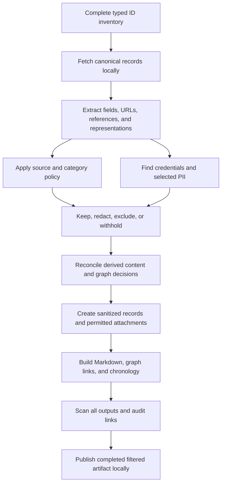

# Chronological export with local privacy filtering

Research date: 2026-09-28. This document supplements [the endpoint/traversal guide](EXPORT_GUIDE.md). It records inspected Pieces source, current upstream tool documentation, a local synthetic scanner experiment, and a proposed exporter design. A first runnable Go CLI now implements a subset of this design; see [README](README.md) for actual features, JSON configuration, and limitations. No real Pieces data was scanned during this research.

**Recommendation:** implement a local policy pipeline combining schema-aware credential removal, a secret detector, optional financial/identity detection, and explicit domain/category rules. Generate chronological Markdown and sanitized JSON from the same filtered graph. A website blocklist or a secret scanner alone cannot cover all of those jobs.

We have enough API knowledge to build a chronological export of retained, exposed local records. We still need live OS compatibility tests and further coverage work; inaccessible internal records, deleted history, and missing attachments remain gaps. [Chronological behavior and readiness](EXPORT_GUIDE.md#chronological-export-and-readiness).

## Contents

- [Export modes and completeness](#export-modes-and-completeness)
- [What Pieces already exposes](#what-pieces-already-exposes)
- [Local CLI and SDK options](#local-cli-and-sdk-options)
- [Website categories and allow/deny rules](#website-categories-and-allowdeny-rules)
- [Where filtering happens](#where-filtering-happens)
- [Summaries, personas, and graph propagation](#summaries-personas-and-graph-propagation)
- [Proposed policy file](#proposed-policy-file)
- [Validation and implementation order](#validation-and-implementation-order)

## Export modes and completeness

These are proposed product choices, not current command-line flags:

| Mode | Output | Meaning of complete |
| --- | --- | --- |
| Preservation archive | Original JSON, original text, and recoverable attachments | All obtainable records within the declared API scope, with explicit gaps. Can include credentials and private information. |
| Filtered export — recommended for ordinary migration | Sanitized JSON, Markdown, permitted attachments, filtered graph, chronological indexes, and a policy summary | All eligible records processed under the selected policy. Intentionally removed data is counted separately from fetch/scan failures. |
| Strict allow-only export | Only approved sources and content that passes the stricter policy; uncertain derived content and unscannable files withheld | Complete processing of the source inventory, with potentially substantial intentional exclusions. |

A filtered export is deliberately not a lossless backup or a guarantee of anonymity. Names, dates, and relationships may remain useful and identifying. Offer broader PII masking separately from credential/financial filtering so enabling API-key protection does not automatically erase the user's entire person graph or chronological dates.

The implemented payment-card heuristic excludes numeric matches wholly contained in a complete UUID token. Otherwise a Luhn-valid numeric UUID prefix can wrongly withhold a record or break its references. This exemption applies only to the card heuristic: adjacent/standalone/formatted/numeric card values, credential fields, and exact copies of known secrets still redact. Tests exercise UUID record IDs, reference-map keys, URLs, filenames and final Markdown/PDF auditing.

Record sanitizing and the final output audit read each URL the same way. A sanitized URL such as `?token=REDACTED` can appear as a link label followed by `](`, as a link destination followed by `)`, before an escaped `\#` fragment or a rendered hard line break, or inside a title cut with `…`. Both passes end the URL at that syntax, read Markdown escapes as the characters they stand for, and accept a cut marker such as `token=REDACTE…`. A suffix that would hide a credential query parameter stays part of the URL. Sanitizing therefore keeps punctuation that follows a redacted URL, and it checks the destination of a link whose label is also a URL on its own, including against domain rules. Generated titles, labels, and previews are not cut inside a URL's host or query, and file names are not cut inside a run of digits. Display formatting that changes text, such as a multi-line description shown on one line, a shortened title, or a vault title with Markdown stripped, is scanned again before it is written, so a line break that became a space cannot leave a card-shaped number in the output. The audit reads `\_`, `&lt;` and `&gt;` in generated Markdown as the characters they stand for. Without this, a correctly redacted credential URL in any record title failed the whole export with "final output scan found content requiring review". Any other credential value, user information, or a credential URL following a link label still fails the audit. The error names the output file and the finding kind, never the value.

The secret scanner's time limit grows with the text it scans. Gitleaks runs every rule whose keyword appears anywhere in a fragment over that whole fragment, then rescans it in decoding passes, so one call's time grows with its size. Real 1 MiB notes took 3.6 to 19 seconds depending on machine load, and 1 MiB that mentions every rule keyword took longer than 10 seconds twice. A fixed 10-second limit failed those exports with "secret scan did not finish after one full retry". Each call now gets 10 seconds plus 10 seconds per 64 KiB, so a stalled scan still fails closed. The text is never split, so detection is the same as one whole scan, including private key blocks and encoded secrets of any length. The final audit's 1 MiB reads overlap by 16 KiB, so a private key block up to that size spanning two reads is still found. If a scan does run out of time, the audit error names the output file.

Optional [SDK-cache recovery](SDK_CACHE_RECOVERY.md) imports historical typed relationship IDs, not cached text or embedded records. Targets must be current fetched records. Excluded/withheld targets remain in the private graph for dependency propagation before any output link is generated; a cached link must not restore content excluded by the selected policy. Missing targets stay unlinked, historical evidence remains labeled, and the archive remains partial.

Do not put a preservation archive inside the filtered export directory or ZIP. If the user selects both, produce separate artifacts and clearly identify the private original. For filtered-only runs, process raw responses locally before writing content to the export; do not quietly create an unredacted sidecar, debug log, crash attachment, or checkpoint payload.

Track collection inventory, successful fetches, included records, redacted records, intentional exclusions, withheld/review-needed items, missing records, and operational failures. Redacted records are a subset of included records, not an extra set to add to totals. An export with unresolved scanner failures cannot be labeled as having successfully applied the policy.

## What Pieces already exposes

### Sensitive findings are useful evidence, not a complete filter

`SENSITIVES` is already enumerable through `/materials/identifiers`, with `/sensitives/batch/fetch` and `/sensitive/{id}` reads. A `Sensitive` record includes `text`, asset association, category, severity, description, and optional match/entropy metadata. Categories include API keys/tokens, client secrets, access keys, private keys, and webhook URLs, but also things such as public keys/client IDs. [Common schemas][pieces-common], [sensitive reads][pieces-sensitives].

Use these findings as additional detection evidence for saved assets. They do not establish that all workstream events, transcripts, personas, messages, or new fields have been scanned. The finding's own `text`, description, or match metadata may reproduce the secret. A filtered export must sanitize the findings too, rather than faithfully copying this collection into `raw/`.

The `UserProfile` schema explicitly contains an `apiKeys` string array, and a person can embed a profile at `type.platform`. That is a schema-based removal rule even if a token is too short or unusual for a detector. Apply it to every occurrence of a user profile, including nested references. Review returned auth/provider/connector structures for credential-bearing fields as well; do not assume every object called `token` is harmless or every string called `key` is secret. [UserProfile wire model][pieces-user-profile], [PersonType model][pieces-person-type].

### Server event filters do not provide a privacy export

`MaterialFilterConfigurations` exposes `workstream_events.context.application`, `window`, `url`, `type`, and audio-specific options. The event-specific material handler forwards these alongside temporal filters. [Configuration schema][pieces-common], [event handler][pieces-event-handler].

In the inspected database implementation, application/window/URL predicates compare context field values for **equality**. They are not domain suffix matching, category lookup, regex rules, or a general exclusion list. The filter also requires a created/updated bound; context configuration alone is insufficient in that implementation. Its URL paths do not cover every alternate event URL representation. These are useful query optimizations after compatibility testing, not the export's privacy boundary. [Event database filters][pieces-event-database].

Pieces also has `WorkstreamSourceFilterService`, whose purpose is deciding whether captured events should be saved. It handles ignored sources and organization website patterns; the inspected website check uses URL substring matching. Existing capture exclusions are useful context, but do not retroactively sanitize retained data or guarantee removal from generated summaries. The exporter should read its data without changing OS capture settings, and implement its own explicit matching semantics. [Capture filter service][pieces-source-filter].

## Local CLI and SDK options

| Tool | Appropriate use here | Integration decision |
| --- | --- | --- |
| **Gitleaks** | Local secret detection over text, directories, and stdin, with machine-readable findings and configurable rules. | Start with a pinned adapter: version **8.30.1 is already installed locally** and was exercised below. Keep the detector replaceable: upstream now says feature development has ended and future releases are security patches. [Project][gitleaks]. |
| **Betterleaks** | Successor project maintained by Gitleaks contributors; filesystem/stdin scanning and configurable rules. | Evaluate alongside Gitleaks before choosing the shipped detector. Its live credential validation makes HTTP requests; leave validation disabled in this exporter. Not installed or benchmarked in this research. [Project][betterleaks], [scan options][betterleaks-scanning]. |
| **Presidio Analyzer + Anonymizer** | Python SDKs for detecting typed PII spans and applying replacements/redaction; local deployment is supported. | Add for optional financial/identity masking. Preinstall the selected local NLP assets and use local recognizers; do not configure remote recognizers. [Analyzer][presidio-analyzer], [Anonymizer][presidio-anonymizer]. |
| **Yelp detect-secrets** | Alternative Python secret detector with configurable plugins and audit/baseline workflow. | Useful if a Python detector fits the implementation. Disable network verification with `--no-verify`; a secrets baseline is not a sanitized archive. [Project][detect-secrets]. |
| **TruffleHog** | Another secret detector supporting filesystem scans and credential verification. | Optional comparison tool, not required for the first version. Use `--no-verification` for local-only detection and do not select only verified results. [Project/options][trufflehog]. |

Gitleaks/Betterleaks are secret detectors, not broad financial/identity scrubbers or website categorizers. Presidio supports entity types such as `CREDIT_CARD`, `IBAN_CODE`, `US_BANK_NUMBER`, `US_SSN`, email addresses, and phone numbers. Select recognizers by the user's relevant locales; a US account-number recognizer does not imply worldwide banking coverage. [Supported entities][presidio-entities].

Presidio is now maintained under Data Privacy Stack after originating at Microsoft. Its own documentation states that automatic detection can miss sensitive information. We should measure recall and false positives on representative export fixtures instead of presenting any detector as a guarantee. [Project status and limitations][presidio-faq].

### What was actually tested locally

Using the installed `gitleaks 8.30.1`, a temporary text fixture contained a randomly generated, nonfunctional GitHub-token-shaped string. The scan used an explicit default-extended config, an empty ignore directory, inline suppression bypass, `--redact=100`, and a distinctive findings exit code of 10. It returned one `github-pat` finding. The fixture token did not appear in the captured report/logs, and the input file remained byte-for-byte unchanged. Temporary files were removed. No token was verified with a provider and no user data was used.

**`--redact` masks scanner findings; it does not rewrite the scanned files.** The exporter still needs to apply removals/replacements to its records. Scanner finding structures can contain match text and secrets, so full findings should not become ordinary application logs. [Finding/redaction implementation at the tested version][gitleaks-finding].

An integration command for a prepared, private text staging directory could look like this. This is an example for the installed tool, not an implemented export command:

```sh
gitleaks dir ./private-scan-input \
  --config ./policy/gitleaks.toml \
  --gitleaks-ignore-path ./policy/empty-ignore-dir \
  --ignore-gitleaks-allow \
  --max-decode-depth 0 \
  --redact=100 \
  --exit-code 10 \
  --no-banner --no-color \
  --report-format json \
  --report-path ./private-scan-report.json
```

The referenced directories/config must be created by the integration. A minimal TOML config can extend the pinned built-in rules with `[extend]` and `useDefault = true`. Exit 10 means findings in this invocation; distinguish it from a clean scan and an operational failure. Do not load ignore/config files from exported user content or let embedded `gitleaks:allow` comments suppress detection. Pin scanner/rule versions and explicitly set limits instead of relying on changing defaults. [CLI/config documentation][gitleaks].

The example disables recursive scanner decoding because its input is intended to be normalized text. The application must separately decode and inspect supported encoded representations with limits, or withhold them; running that command over arbitrary encoded payloads is insufficient. No example shell command here implements the complete privacy pipeline.

For production, prefer a long-lived local worker or in-process detector adapter over one subprocess per tiny field. Normalize detector results to `(material type, ID, JSON pointer, span, detector, rule)`; implement the actual redaction in a separate layer. Gitleaks exposes a Go detection package if the eventual runtime makes embedding appropriate. Its finding offsets must be mapped to the actual secret span, not blindly treated as exact JSON value offsets. [Detector source][gitleaks-detector], [finding fields][gitleaks-finding].

Keep raw finding values in memory only when needed for replacements. Persist only safe rule/type/location information, with no original secret or surrounding excerpt. The test above covers one finding shape, not all possible report fields, multi-part rules, filenames, or encoded credentials; the exporter's logging boundary must enforce its own allowlist.

Presidio and `tldextract` were not installed here. Their APIs were reviewed in upstream documentation; no performance or detector-accuracy claim is made for them.

## Website categories and allow/deny rules

### Category data can stay local

**UT1 / Université Toulouse Capitole provides downloadable `adult` and `bank` categories**, along with categories such as gambling and mixed-adult sites. This matches the requested use case without requiring per-URL network lookups. The maintainers emphasize the adult list and invite contributions for other categories, so banking coverage should be supplemented with the user's explicit domains. Treat categories as evidence with false positives and gaps, not a complete catalog. [UT1 category descriptions and downloads][ut1].

The site links its dataset to **CC BY-SA 4.0**. Preserve attribution and the downloaded dataset's license/notices, and review redistribution obligations before bundling a modified category database. Store retrieval date, source URL, category, content hash, and policy version. Freeze one local snapshot for the duration of an export; update lists as a separate operation that sends no user URLs. [UT1 license link][ut1], [license][ut1-license].

Store imported categories in a local indexed structure, such as SQLite or a reversed-hostname trie. Use a provider adapter so another category source can be evaluated later. Preserve domain-only versus URL/path-specific rule distinctions when importing; do not widen a path rule to its entire shared host without declaring that behavior.

A category miss means **unclassified**, not “safe.” Banking lists may miss brokerage, payroll, payment portals, regional institutions, and native apps. Adult material can occur on mixed-use sites, in downloaded files, in images, or in prose with no URL. Domain filtering addresses source selection; content classification is a separate optional feature. Do not silently classify sexual-health/education content as pornography based on one keyword.

### Explicit matching and precedence

Proposed evaluation order for each source URL:

1. A matching explicit deny rule excludes it.
2. Otherwise, an explicit allow rule admits it despite a category match. It never bypasses credential/PII checks.
3. Otherwise, a denied category excludes it.
4. In allow-only mode, withhold anything without an explicit allow decision.
5. In ordinary denylist mode, keep unmatched sources but record their unclassified status where relevant.

Make this precedence visible in previews. An allow exception to an explicit deny requires editing/removing that deny; it must not depend on file order. App, filename/path, material-type, and date filters can be separate selectors, with their scope recorded in the manifest. Policy exclusions always win over graph dependency expansion.

Parse URLs before matching. Lowercase and IDNA-normalize hostnames, remove a terminal hostname dot, handle ports/userinfo explicitly, and use label-boundary comparisons. An exact-host rule matches only that host; a domain-and-subdomains rule matches `host == domain` or `host.endsWith('.' + domain)`. A deny for `bank.example` should match `login.bank.example`, but not `bank.example.evil.test` or `notbank.example`. Never use `url.contains('bank.example')` as the host check.

For registrable-domain grouping, use the Public Suffix List, including its private-domain section when treating separate tenants such as hosted subdomains. Do not derive registrable domains by taking the last two labels; do not automatically turn a tenant-specific rule into a rule for its entire hosting platform. [PSL][public-suffix], [tldextract behavior][tldextract].

In a Python implementation, `tldextract.TLDExtract(suffix_list_urls=(), include_psl_private_domains=True)` disables automatic HTTP fetching and uses available cached/bundled suffix data. A pinned local PSL file with a controlled cache is preferable for reproducible builds. Perform URL validation separately: `tldextract` intentionally accepts loose input. [Offline and local-list configuration][tldextract].

Inspect the actual host, not the apparent host in a URL's username or path. Treat malformed URLs, IP addresses, scheme-less values, percent-encoding, and Unicode edge cases explicitly. For path rules, define slash-boundary matching and bounded decoding; for example `/accounts` should not accidentally mean `/accounts-news`. Do not visit pages, resolve shortlinks, or query DNS merely to classify historical records. Unknown redirect destinations remain unknown unless already present in the record.

### Apply website rules beyond the websites collection

Check event-level `browserUrl`, contextual browser/OCR/clipboard/audio URL fields, calendar links where relevant, websites, source windows, anchors, saved asset origins, and URLs inside annotations/messages/personas. The wire contract has multiple representations; adapters should extract provenance from each supported one. [Common event/context models][pieces-common].

Distinguish an **origin/source URL** from a **link mentioned in prose**. A denied captured banking page should exclude its event payload, not merely remove the address while retaining account balances in OCR text. A citation to that page can instead be removed/replaced as a link span, unless stricter policy excludes the containing record. The decision must be explicit and must also sanitize link labels, titles, and duplicate URL fields. Shared website membership alone does not prove all connected content originated there.

## Where filtering happens

The following is a proposed pipeline, not server behavior:



1. **Inventory first.** Enumerate all relevant collections, then classify decisions separately from missing IDs. Server-side source filtering alone cannot account for excluded records or sanitize their other representations.
2. **Remove known credential fields.** Redact actual credential values in `UserProfile.apiKeys`, embedded profiles, and reviewed auth/provider structures. Strip URL userinfo and recognized credential-bearing query/fragment values. Detect signatures/tokens in other URL components as well. Preserve ordinary identifiers needed for graph integrity unless identity masking is explicitly enabled.
3. **Scan decoded content, including code.** Extract strings from JSON structurally; scan annotation text, messages/tool payloads, event OCR/clipboard/transcripts, names/titles/descriptions, sensitive findings, metadata, and text attachments. Recursively inspect unknown JSON string fields too. Link rewriting avoids code fences, but secret redaction must scan code fences and inline code. Include structured numeric account/card fields where appropriate; text-only recursion is insufficient.
4. **Handle alternate representations together.** A secret removed from `string.raw` must not survive in base64, a data URL, HTML/RTF, preview content, an embedded reference, or a copied attachment. Decode supported formats with size/depth limits, track provenance, then regenerate sanitized equivalents or omit the original representation. A decoded finding that cannot be mapped back reliably should withhold the field/record rather than claim success.
5. **Apply replacements to the data model.** Merge overlapping detections, preserve correct UTF-8/Unicode offset mappings, and replace spans from the end of the string or with a tested interval renderer. Use visible markers such as `[REDACTED:API_KEY]`. Do not put the original value in front matter, comments, tooltips, reports, or a public reversible map. Validate output JSON/Markdown after rendering.
6. **Handle attachments independently.** Text scanning does not sanitize screenshots, image pixels, embedded PDF text/images, audio, or arbitrary archives. In the first filtered version, withhold unsupported binaries or require explicit local review; do not include them as supposedly scanned. Redacting an OCR transcript does not alter the source image, and redacting a transcript does not mute the recording. Future local OCR/image/document redactors need separate tests.
7. **Persist only approved representations.** Use `data/` or `sanitized/`, not `raw/`, for rewritten JSON. Keep checkpoints and private review metadata outside the downloadable artifact. Use opaque ID paths; original titles/filenames can reveal excluded content. Do not preserve public checksums of small removed secrets or reversible replacement tables.
8. **Render from the filtered graph.** Generate Markdown, relative links, backlinks, daily indexes, conversation transcripts, relationship JSONL, and link maps from sanitized records. No later renderer may reach back to the original payload to fill in a missing title or excerpt.
9. **Verify the final artifact.** Re-scan every included text/JSON/HTML/index/report and supported extracted attachment representation. Audit that omitted records are absent from content and navigation, that retained links resolve, and that detector failures/oversize/unsupported data are reported. A clean scanner result is an operational check, not proof of no sensitive information.

For streaming large exports, keep bounded batches and a disk-backed graph/decision index. Persist sanitized candidate records privately until dependency decisions are final; do not add them to the completed artifact early. A policy/version change invalidates those decisions, and updated source records need fresh scans. Missing detectors, corrupt category lists, worker crashes, and scan timeouts must withhold affected output rather than default to copying originals.

After tool/model/list assets are provisioned, classification and sanitization can run locally with no external services. The worker should have no outbound network access; the collector only needs the configured local OS endpoint. This is a proposed runtime constraint. The source OS's own authentication/cloud behavior is a separate dependency described in the endpoint guide.

## Summaries, personas, and graph propagation

Removing a banking event does not remove a summary paragraph about that account, a parent summary, a conversation answer, or a persona inference. A category list cannot detect a paraphrase lacking a domain, and financial-number detection cannot remove every sensitive fact such as a balance or institution relationship.

For directly excluded source events, inspect summary membership, supporting annotations, known generated-message context, hierarchy-derived summaries, and persona evidence links. Build a **directed dependency set** for possible derived content and withhold it under the strict policy until assessed. Merely sharing a person/tag/website is not sufficient to propagate exclusion to every connected node. Otherwise one excluded event could erase an entire graph.

| Situation | Ordinary filtered policy | Strict policy |
| --- | --- | --- |
| Record originates from an explicitly denied source | Exclude body and sensitive metadata. | Same. |
| Secret/selected PII appears in otherwise permitted text | Redact matching fields/spans and re-scan. | Same, or withhold if transformation cannot be verified. |
| Summary/persona/message has known context from excluded records | Withhold generated content for local review; do not assume URL removal sanitizes the narrative. | Exclude/withhold that derived content. |
| Generated content has incomplete provenance and no detected issue | May retain after scanning, explicitly declaring that semantic privacy is unverified. | Withhold generated content whose permitted provenance cannot be established. |
| Shared tag/person is linked to an excluded record | Keep independently eligible data; prune that edge/backlink. Scan its own annotations separately. | Same; do not delete shared identity solely due to adjacency. |
| Unsupported image/audio/PDF/archive | Withhold pending a format-specific sanitizer or explicit local review. | Withhold. |

Here, “withhold” means absent from the final export. Original content can remain in Pieces and be re-fetched for local review. It does not mean placing a `quarantine/` folder containing originals inside the export ZIP.

Never generate replacement narratives by sending data to an LLM as an implicit export step. A future optional local rewrite feature would be new derived content with a separate provenance record, not a recovered original. Unknown semantic leakage is a documented limitation even after category/secret scans; strict policy trades completeness for more conservative inclusion.

Keep canonical paths for retained nodes. For a removed target, either remove its edge or point to a neutral “omitted by export policy” stub, according to policy. Do not leak its original title, URL, text, filename, or timestamp through a stub. The filtered `relationships.jsonl` and `link-map.json` must also omit those values. Detailed original-URL explanations belong in a separate private review view; the portable report should default to coarse counts and safe rule identifiers.

## Proposed policy file

This YAML is a **future design sketch**, not accepted syntax for Pieces, Gitleaks, Presidio, or the current CLI. The CLI instead accepts [this smaller JSON schema](policy.example.json). Example domains are placeholders.

```yaml
version: 1
mode: filtered
preserve_originals: false

timeline:
  order: ascending
  timezone: UTC
  include_future: true
  include_undated: true

secrets:
  enabled: true
  detector: gitleaks
  verification_network: false
  known_credential_fields: redact
  replacement: "[REDACTED:SECRET]"
  on_scan_error: withhold

pii:
  enabled: true
  engine: presidio_local
  entities: [CREDIT_CARD, IBAN_CODE, US_BANK_NUMBER, US_SSN]
  mask_people_names: false
  mask_emails: false
  # Entity selection is configurable for the user's countries and use case.

sources:
  mode: denylist
  category_provider: ut1_local_snapshot
  deny_categories: [adult, bank]
  deny:
    - domain: bank.example
      include_subdomains: true
    - domain: adult.example
      include_subdomains: true
  allow:
    - host: research.work.example
  explicit_deny_wins: true
  on_unclassified: keep_and_mark
  on_required_list_error: fail_export
  denied_origin_action: exclude_record
  denied_mention_action: redact_link_and_label

derived_content:
  known_excluded_context: withhold
  incomplete_provenance: keep_with_limitation

attachments:
  unscannable: withhold

graph:
  omitted_targets: remove_edges
  include_original_values_in_reports: false
```

For strict allow-only mode, change source mode to `allow_only`, unclassified handling to `withhold`, and incomplete derived provenance to `withhold`. Provide a preview of retained/redacted/excluded/review-needed counts by material type before writing the final artifact. Local review can explain individual decisions without putting their original contents into the portable report.

Website allow rules must never disable secret/PII detectors. Detector false-positive exceptions are a separate, narrowly scoped mechanism. Store policy and rule-set hashes for reproducibility, but do not blindly copy a private custom denylist or replacement map into the exported report.

## Validation and implementation order

The first implementation should establish the filtered representation boundary before rendering or attachment copying. Suggested order:

1. Build the complete inventory/hydration loop and chronological index specified in the endpoint guide; retain explicit missing/unsupported counts.
2. Add the policy model, schema-based credential removal, URL normalization, explicit allow/deny rules, and safe decision reporting.
3. Integrate the pinned local secret detector and actual span/field redaction; compare Betterleaks on the same synthetic fixtures before choosing the distributed engine.
4. Add optional local financial/PII recognition and pinned website-category imports. Measure false positives and missed examples by rule, language, and data type.
5. Add directed derived-content decisions, rebuild the filtered graph, render Markdown/JSON/timelines, and scan all final outputs.
6. Add binary sanitizers only with format-specific validation. Keep unsupported formats explicitly withheld meanwhile.

Required fixtures and checks:

| Area | Cases that must be covered |
| --- | --- |
| Chronology | Inclusive server boundaries, tied timestamps, DST transitions, summary coverage versus creation, calendar future/date-only entries, absent timestamps, and edits during export. |
| Known fields | Short/low-entropy credentials in `UserProfile.apiKeys`, embedded `Person.type.platform`, and the `SENSITIVES` finding itself. |
| Text duplication | Same synthetic secret in an event, annotation, persona, message/tool result, title, raw-equivalent JSON, HTML attribute, code fence, and index excerpt. Every included copy is removed. |
| Encoding | Escaped JSON, URL query/fragment/userinfo, base64/data URLs, Unicode preceding a match, overlapping detections, split/chunk-boundary content, large fields, and alternate format representations. |
| Website rules | Exact host versus subdomain, lookalike suffixes, userinfo spoofing, uppercase/trailing-dot hosts, IDNs, public/private suffixes, malformed URLs, path boundaries, and mixed-category allow exceptions. |
| Domain coverage | Denied origin with no obvious secret; denied link inside permitted prose; uncategorized bank/native app; mixed-use site; no network resolution of unknown redirects. |
| Graph | Excluded event → child summary → parent summary/persona context, without excluding an unrelated event that shares a tag/person. No content restored by relationship hydration or backlinks. |
| Attachments | Sanitized transcript with original audio withheld; sanitized OCR with original image withheld; failed PDF extraction, opaque binary, nested archive limits, and no unscanned file silently copied. |
| Errors/resume | Missing scanner/model/list, nonzero error versus findings exit code, timeouts, policy changes, interrupted writes, and updated records. Failures never yield original-content fallback. |
| Reports/package | No secrets or excluded domains/titles in logs, manifests, link maps, checksums of removed values, review files, temporary-file names, or packaged originals. Inspect the final directory/ZIP, not just Markdown. |
| Offline operation | Pre-provisioned tools/models/lists; deny external network for scanning and confirm no validation, telemetry, category lookup, or remote recognizer is needed. |

The research initially executed the synthetic Gitleaks experiment described above. The Go implementation now adds fixture-based checks for chronology, graph links, batch fallback, source exclusion and derived-summary removal, credential propagation, offline domain rules, and final-output scanning. The broader rows above remain acceptance criteria, not a claim that every scenario has passed. No large-history benchmark, full secret-detection evaluation, live OS export, or semantic adult-content classifier has been run.

[pieces-common]: https://github.com/open-runtime/generated_runtime/blob/076409253e6e7e362f8dac50728fbcfad4fb04fa/spec/common/runtime_common_library.yaml
[pieces-sensitives]: https://github.com/pieces-app/isomorphic_server/blob/91ddc9a880f1275e20f7c939a2c890a07ebfb452/lib/sensitives_internal_server.dart
[pieces-user-profile]: https://github.com/open-runtime/generated_runtime/blob/076409253e6e7e362f8dac50728fbcfad4fb04fa/sdk/http/dart/common/lib/model/user_profile.dart
[pieces-person-type]: https://github.com/open-runtime/generated_runtime/blob/076409253e6e7e362f8dac50728fbcfad4fb04fa/sdk/http/dart/common/lib/model/person_type.dart
[pieces-event-handler]: https://github.com/pieces-app/isomorphic_server/blob/91ddc9a880f1275e20f7c939a2c890a07ebfb452/lib/utils/material_handlers/data_handlers/workstream_events_material_data_handler.dart
[pieces-event-database]: https://github.com/pieces-app/database_facade/blob/43ba1bd444f5944fa1af882e43761b56b31e3809/lib/couchbase/databases/workstreamEvents/database.dart
[pieces-source-filter]: https://github.com/pieces-app/database_facade/blob/43ba1bd444f5944fa1af882e43761b56b31e3809/lib/services/workstream_source_filter_service.dart
[gitleaks]: https://github.com/gitleaks/gitleaks
[gitleaks-finding]: https://github.com/gitleaks/gitleaks/blob/v8.30.1/report/finding.go
[gitleaks-detector]: https://github.com/gitleaks/gitleaks/blob/v8.30.1/detect/detect.go
[betterleaks]: https://github.com/betterleaks/betterleaks
[betterleaks-scanning]: https://github.com/betterleaks/betterleaks/blob/main/docs/scanning.md
[presidio-analyzer]: https://presidio.dataprivacystack.org/analyzer/
[presidio-anonymizer]: https://presidio.dataprivacystack.org/anonymizer/
[presidio-entities]: https://presidio.dataprivacystack.org/supported_entities/
[presidio-faq]: https://presidio.dataprivacystack.org/faq/
[detect-secrets]: https://github.com/Yelp/detect-secrets
[trufflehog]: https://github.com/trufflesecurity/trufflehog
[ut1]: https://dsi.ut-capitole.fr/blacklists/index_en.php
[ut1-license]: https://creativecommons.org/licenses/by-sa/4.0/
[public-suffix]: https://publicsuffix.org/list/
[tldextract]: https://github.com/john-kurkowski/tldextract/blob/master/README.md

## Summaries without event history

`--scope summaries` skips event bodies and source-window history. Text/credential/financial detection and domain rules still run on every included representation. A domain exposed only in omitted activity is unavailable to ordinary domain-origin filtering, and event-derived graph connections are reduced. Do not describe this mode as excluding every summary influenced by an adult or banking website. With source filtering configured, `withhold_unproven_generated_content: true` still withholds generated summaries/annotations rather than treating unobserved origins as approved. Scope omissions are reported separately from missing selected records.
