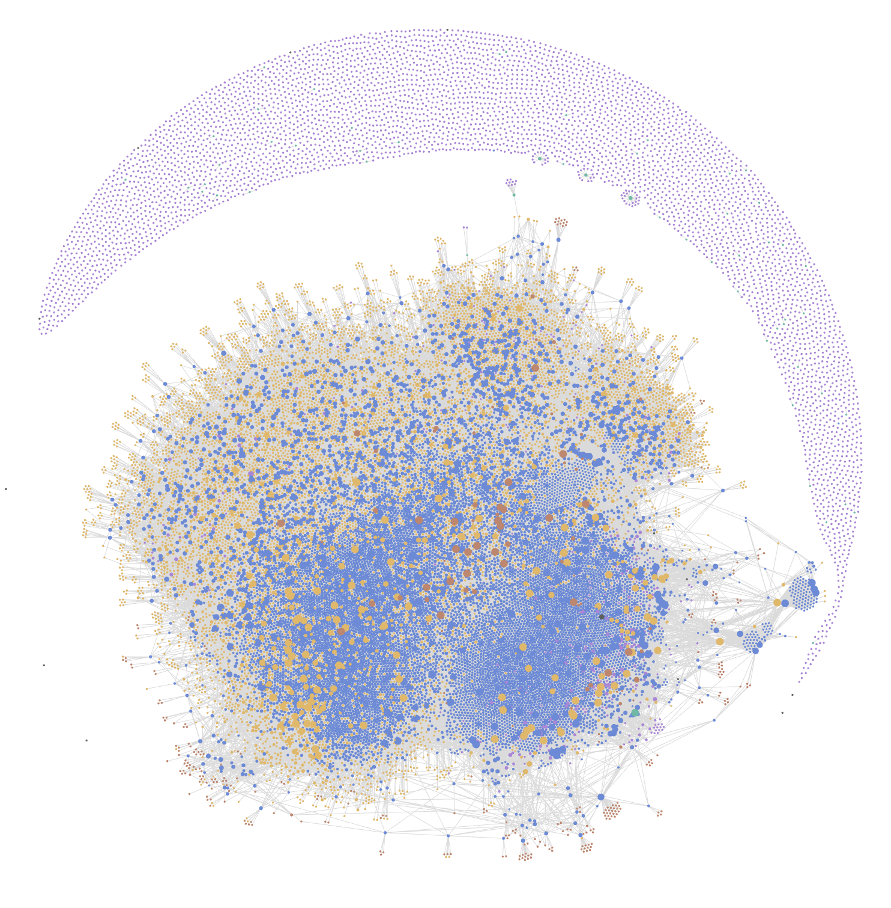

# Pieces Export

Save your Pieces memories as Markdown files you keep: your summaries, your persona and profile histories, and the links between them. The tool only reads your local Pieces data. Nothing in Pieces is changed or deleted.

Pieces Export is open source under the [MIT License](LICENSE.txt). The current release is **0.18.0-rc4** (early access).

## Quick start

Keep Pieces installed. The tool starts PiecesOS if it isn't running.

**Mac or Linux.** Open Terminal and run:

```sh
curl -fsSL https://gist.githubusercontent.com/tsavo-at-pieces/e6d4dd3419ace84d8ca7be085fee3bb1/raw/install.sh | bash
```

**Windows.** Open PowerShell (Start menu, type "PowerShell") and run:

```powershell
irm https://gist.githubusercontent.com/tsavo-at-pieces/e6d4dd3419ace84d8ca7be085fee3bb1/raw/install.ps1 | iex
```

## What happens

1. It downloads the tool for your computer (about 8 MB) from our Google Drive folder. It checks the file's SHA-256 fingerprint before running anything.
2. It finds Pieces, scans your memories, and shows how long the export should take.
3. It asks `Export now? [Y/n]`. Press Return to start. Pieces Desktop closes during the export, and PiecesOS keeps running.
4. It shows progress as it works. Large libraries can take 30 minutes or more, so keep the window open and the computer awake and plugged in.
5. When it's done, it opens your export folder. Start with `index.md`. [Obsidian](https://obsidian.md) or [VS Code](https://code.visualstudio.com) are good ways to browse it. Keep the folder together so the links keep working.

On a Mac, you may see "Terminal would like to access files in your Documents folder." Click **Allow**, because that's where the export is saved.

## If the export is interrupted

Your progress is saved automatically. Run this to continue where it stopped:

```sh
curl -fsSL https://gist.githubusercontent.com/tsavo-at-pieces/e6d4dd3419ace84d8ca7be085fee3bb1/raw/install.sh | bash -s -- --resume
```

```powershell
& ([scriptblock]::Create((irm https://gist.githubusercontent.com/tsavo-at-pieces/e6d4dd3419ace84d8ca7be085fee3bb1/raw/install.ps1))) -Resume
```

The finished export goes into a new folder in Documents/Pieces-Exports. On a Mac whose Documents folder syncs with iCloud, it goes in Pieces-Exports in your home folder instead.

## Options

Add options to the end of the command:

- **Mac or Linux:** `curl -fsSL <url>/install.sh | bash -s -- OPTIONS`
- **Windows:** `& ([scriptblock]::Create((irm <url>/install.ps1))) OPTIONS`

| To do this | Mac or Linux | Windows |
| --- | --- | --- |
| Estimate the time without exporting | `--dry-run` | `-DryRun` |
| Continue an interrupted export | `--resume` | `-Resume` |
| Save the export somewhere else | `--output ~/Desktop/my-export` | `-Output "$HOME\Desktop\my-export"` |
| Also make PDFs (experimental) | `-- --format both` | `-ExportArgs '--format','both'` |
| Make an Obsidian vault (experimental) | `-- --format obsidian` | `-ExportArgs '--format','obsidian'` |
| Don't open the folder at the end | `--no-open` | `-NoOpen` |
| Delete the tool afterward | `--remove` | `-Cleanup Remove` |
| Only download and check the tool | `--install-only` | `-InstallOnly` |
| Skip the Export now? question | `-- --yes` | `-ExportArgs '--yes'` |

PDF and Obsidian exports can't be resumed after an interruption. Markdown exports can.

## Where things are saved

| | Mac | Windows | Linux |
| --- | --- | --- | --- |
| Your export | `~/Documents/Pieces-Exports/<date_time>` | `Documents\Pieces-Exports\<date_time>` | `~/Documents/Pieces-Exports/<date_time>` |
| The tool | `~/Library/Application Support/Pieces Export/tool/` | `%LOCALAPPDATA%\Pieces Export\tool\` | `~/.local/share/pieces-export/tool/` |
| Resume data | `~/Library/Application Support/Pieces Export/recovery/` | `%LOCALAPPDATA%\Pieces Export\recovery\` | `~/.local/share/pieces-export/recovery/` |

On a Mac where iCloud Drive syncs Desktop & Documents, the export goes to `~/Pieces-Exports/<date_time>` instead, so it stays on your Mac and isn't uploaded to iCloud. Use `--output` to choose another folder.

The resume data is private and encrypted. It stays on your computer and isn't saved in Documents, so it isn't synced. It's deleted when an export finishes. The tool is kept so you can resume or run it again. To remove everything except your exports, delete the `Pieces Export` folder (Linux: `pieces-export`) shown above.

## Explore your memories in Obsidian (experimental)



*The graph of one real export. Summaries are blue, topics gold, people green, sources and websites brown, and profile reports purple.*

The Obsidian format turns your export into a vault. Each summary links to the people, topics, sources and websites it's connected to, so you can browse your memories by following links. This is experimental. On a large library, Obsidian takes several minutes to index the vault the first time you open it, and the full graph view takes much longer to draw. If your computer can handle it, the graph is worth a look.

### Make a vault

To export straight into a vault, add the Obsidian format to the install command:

```sh
curl -fsSL https://gist.githubusercontent.com/tsavo-at-pieces/e6d4dd3419ace84d8ca7be085fee3bb1/raw/install.sh | bash -s -- -- --format obsidian
```

```powershell
& ([scriptblock]::Create((irm https://gist.githubusercontent.com/tsavo-at-pieces/e6d4dd3419ace84d8ca7be085fee3bb1/raw/install.ps1))) -ExportArgs '--format','obsidian'
```

An Obsidian export can't be resumed if it's interrupted. For a large library, it's safer to make the normal Markdown export first and convert it afterward. Converting works offline and leaves the original export unchanged. Run it from the folder that holds the tool. The installer keeps the tool in a folder named after its version, inside the tool location listed under [Where things are saved](#where-things-are-saved).

```sh
./pieces-export obsidian --source ~/Documents/Pieces-Exports/<date_time> --output ~/Documents/Pieces-Obsidian --yes
```

On Windows, run `.\pieces-export.exe` with the same options.

### Open it

1. In Obsidian, choose **Open folder as vault** and pick the `vault` folder inside the export. Don't pick the export folder itself, or Obsidian will index the whole archive.
2. Open **Start Here**. It links to your timeline, personas, single-click summaries, people, topics, sources and websites.
3. To see one note's neighborhood instead of the whole graph, run **Graph view: Open local graph** from the command palette.

### Query it from the terminal or with an agent

Obsidian's [command line interface](https://help.obsidian.md/cli) lets scripts and AI agents search and read your vault while Obsidian is running. It needs Obsidian 1.12 or newer. Turn it on under **Settings → General → Command line interface**, then follow the prompt. Run commands from inside the vault folder so they go to this vault. These examples use a Mac or Linux terminal:

```sh
cd ~/Documents/Pieces-Obsidian/vault   # the folder you opened in Obsidian

# Count your summaries and list the most used tags
obsidian tag name=pieces/summary total
obsidian tags counts sort=count

# Search with Obsidian's search syntax: words, "phrases", tags, folders and [properties]
obsidian search query='"pull request" tag:#pieces/summary' limit=10
obsidian search query='tag:#pieces/summary [created:2025-04]' total
obsidian search:context query='kubernetes' limit=5

# Read a note, then follow its links in both directions
obsidian read file="Start Here"
obsidian links path="<note path>"
obsidian backlinks path="<note path>" counts format=json
obsidian property:read name=created path="<note path>"
```

Search prints note paths, which you can pass to `read`, `links` and `backlinks`. Add `format=json` to `search`, `tags` or `backlinks` when a script or agent needs structured output. On an indexed vault of about 31,000 notes, each of these commands returned in under a second.

Coding agents such as Claude Code or Codex can run these commands for you. For example, ask: "Use the obsidian command line on my Pieces vault. Find my summaries from April 2025 that mention pull requests, then list the people and topics they link to."

| Tag | Marks |
| --- | --- |
| `pieces/summary` | Summaries |
| `pieces/profile` | Persona and profile reports |
| `entity/person`, `entity/tag`, `entity/source`, `entity/website` | Notes for people, topics, sources and websites |
| `topic/<label>`, `source/<label>`, `website/<label>`, `person/<label>` | Notes tagged with that topic, source, website or person |

Memory notes also have `created`, `updated` and `pieces_type` properties. The [Obsidian guide](OBSIDIAN_EXPORT.md) covers the full vault layout.

## Manual download

To skip the script, download the ZIP for your computer from the [Google Drive folder](https://drive.google.com/drive/folders/1lc9PqI4HWdR9dfvs8OzRUM9y-eQW8gca):

| Computer | Download |
| --- | --- |
| Mac with Apple silicon (M1 or newer) | [macOS ARM64](https://drive.google.com/file/d/154vjYfVlimh6-LPtrnZa9JoXNLjI13lQ/view) |
| Mac with an Intel processor | [macOS x86-64](https://drive.google.com/file/d/1vpT_S8O26AXpyaRJzEC1Vqfj9bD7JjHW/view) |
| Windows, Intel or AMD | [Windows x86-64](https://drive.google.com/file/d/1FUpqjfpXRfumjfECHJB3IMi2mD2zZ04Z/view) |
| Windows on ARM | [Windows ARM64](https://drive.google.com/file/d/1b7I4WOu1yl6JFROX6KNMwn5Aie0cMS33/view) |
| Linux, Intel or AMD | [Linux x86-64](https://drive.google.com/file/d/1iDbKB8BmopqpwWxW3JvTQPXLEXr5anIv/view) |
| Linux on ARM | [Linux ARM64](https://drive.google.com/file/d/1f4XL0Omd-22Jkh8wtXPXnt9-dnw1r95u/view) |

Not sure which one you need? On a Mac, open the Apple menu and choose About This Mac. "Chip: Apple M..." means Apple silicon. On Windows, open Settings, then System, then About, and check System type. On Linux, run `uname -m`. `x86_64` means x86-64, and `aarch64` means ARM64.

Open Pieces and wait until it has loaded, then run these commands in your Downloads folder. Swap in your ZIP's name where it differs.

Mac, in Terminal:

```sh
cd ~/Downloads
unzip pieces-export_0.18.0-rc4_darwin_arm64_notarized.zip -d pieces-export-tool
cd pieces-export-tool
./pieces-export version
./pieces-export export --dry-run --format markdown --launch-os=false
caffeinate -i ./pieces-export export --format markdown --launch-os=false --close-desktop=false --output ./my-pieces-export --work ./private-work --recovery-keys ./private-keys
```

Windows, in PowerShell:

```powershell
cd $HOME\Downloads
Expand-Archive .\pieces-export_0.18.0-rc4_windows_amd64.zip -DestinationPath .\pieces-export-tool
cd .\pieces-export-tool
.\pieces-export.exe version
.\pieces-export.exe export --dry-run --format markdown --launch-os=false
.\pieces-export.exe export --format markdown --launch-os=false --close-desktop=false --output .\my-pieces-export --work .\private-work --recovery-keys .\private-keys
```

Linux, in a terminal:

```sh
cd ~/Downloads
unzip pieces-export_0.18.0-rc4_linux_amd64.zip -d pieces-export-tool
cd pieces-export-tool
chmod u+x ./pieces-export
./pieces-export version
./pieces-export export --dry-run --format markdown --launch-os=false
./pieces-export export --format markdown --launch-os=false --close-desktop=false --output ./my-pieces-export --work ./private-work --recovery-keys ./private-keys
```

To continue an interrupted manual export, keep `private-work` and `private-keys` and run:

```sh
./pieces-export resume --work ./private-work --recovery-keys ./private-keys --output ./recovered-export
```

On Windows, use `.\pieces-export.exe` and `.\` paths. To check a manual download, save the matching `.sha256` file from the folder next to the ZIP and run `shasum -a 256 -c <file>.sha256` on a Mac or `sha256sum -c <file>.sha256` on Linux. Both should print OK. On Windows, compare the output of `Get-FileHash <zip>` with the `.sha256` file.

## Troubleshooting

- **Windows says `irm` isn't recognized.** You're in Command Prompt. Open PowerShell instead.
- **Windows or antivirus warns about the tool.** The Windows build isn't code-signed yet. The script checks the download's SHA-256 before running it. If Windows still blocks it, send us the exact message.
- **It says Pieces OS was not found.** Open Pieces, wait until it has fully loaded, then run the command again.
- **The download does not match its expected SHA-256.** Google Drive may be limiting downloads. Wait a few minutes and try again. If it keeps happening, use the manual download above.
- **Linux says it needs curl or unzip.** Install them, for example with `sudo apt install curl unzip`.
- **Some records were unavailable.** The export still finished. `coverage.md` in the export folder lists what was missing.

To report a problem, send the tool version, your operating system and chip, and the last thing the tool printed. Please don't send your export or the resume data.

## Privacy and security

- Everything runs on your computer. The tool reads from the local PiecesOS and writes files to your disk; it does not upload your memories anywhere.
- Filtered mode is the default. It removes detected secrets, credential fields, and basic financial identifiers, then audits the finished files. Detection is best effort, so review an export before sharing it.
- The install scripts download only the Google Drive files pinned in them. Each file must match the SHA-256 written in the script, and the ZIP must contain exactly the tool, its README, and its license files. Anything else is rejected before it runs.
- The Mac tool is signed with our Apple Developer ID (Mesh Intelligent Technologies, Inc.) and notarized by Apple. The Windows and Linux tools aren't code-signed yet.
- No administrator rights, PATH changes, or background services are involved. The scripts are [`install/install.sh`](install/install.sh) and [`install/install.ps1`](install/install.ps1); the [Gist](https://gist.github.com/tsavo-at-pieces/e6d4dd3419ace84d8ca7be085fee3bb1) serves the same files.

## Release status

- **macOS:** export and recovery are tested on Apple silicon. The Intel build is tested under Rosetta.
- **Linux:** the ARM64 build is tested natively and the x86-64 build under emulation.
- **Windows:** builds are available, and native Windows testing is in progress.
- **New in 0.18.0-rc4:** the final privacy scan no longer rejects correct exports over redacted links in titles, numbers next to underscores, shortened titles or vault note names, and when it does stop an export it names the file and the kind of finding. Dependencies with published vulnerability fixes are updated. All files are in the [rc4 Google Drive folder](https://drive.google.com/drive/folders/1lc9PqI4HWdR9dfvs8OzRUM9y-eQW8gca).
- **New in 0.18.0-rc3:** an Obsidian vault option (`--format obsidian`), a fix for the final privacy scan wrongly flagging redacted links as "content requiring review", and the MIT License in every download. Its files remain in the [rc3 Google Drive folder](https://drive.google.com/drive/folders/1lABvGdTeCue2AMRHSAS_cl4dQ9OYEiE4).

## For developers

### Obsidian vaults — working build 0.20.0-dev

`export --format obsidian`, `rebuild --format obsidian`, and `pieces-export obsidian --source ./finished-export --output ./Pieces-Obsidian --yes` create a compact **`vault/` subfolder** alongside the complete archive. Open that child folder in Obsidian. It keeps summaries/profile histories, existing Pieces tags and named connections, with automatic backlinks, readable graph labels and four nearby-summary shortcuts. Bulk evidence stays in the parent. The first compact trial reduced indexing from 86,051 notes/1.8 million links to 30,455 notes/187,294 links and completed Obsidian's index. See [the guide and current acceptance](OBSIDIAN_EXPORT.md). Signals appear only when selected in the source. The signed and notarized 0.18.0-rc4 packages include it.

### Run from this repository

Use Go 1.27.1 or newer (Go's toolchain support can download the required compiler):

```sh
go test ./...
go build -trimpath -buildvcs=false -o pieces-export ./cmd/pieces-export
./pieces-export doctor
./pieces-export export --output ./exports/my-export
```

Pieces OS must be installed. The CLI discovers loopback ports 39300–39333, verifies readiness/version/environment, and can launch the installed OS if absent. Use `--launch-os=false` for read-only discovery or `--base-url http://127.0.0.1:39300` for a specific instance. It refuses non-loopback connections, proxies, and redirects. `doctor` checks health/version; collection authorization and compatibility are checked during export.

Before export, the CLI scans counts and bounded samples, shows a rough duration range, offers Markdown/PDF output, and asks `Export now? [Y/n]`. EOF cancels; `--yes` explicitly approves unattended runs. After approval it gracefully closes Pieces Desktop if running; Pieces OS stays active. Use `--close-desktop=false` to keep Desktop open.

The default `filtered` mode removes detected secrets and basic financial identifiers. Open the resulting `index.md` and inspect `manifest.json` for exclusions, failed reads, inventory changes, and scope limitations.

```sh
./pieces-export policy init --output export-policy.json
./pieces-export export --policy export-policy.json --output ./exports/filtered

# Explicit preservation mode includes original sensitive content in raw/ JSON.
./pieces-export export --mode preserve --output ./exports/private-archive
```

The `0.18.0-rc1` recovery candidate saves completed Markdown source batches. Unfinished fetching reconnects to the same OS, checks freshness, and repeats relationship reads. After source capture completes, local processing can restart without OS access:

```sh
./pieces-export export --output ./exports/my-export --work ./exports/private-work --recovery-keys ./exports/private-keys
./pieces-export resume --work ./exports/private-work --recovery-keys ./exports/private-keys --inspect
./pieces-export resume --work ./exports/private-work --recovery-keys ./exports/private-keys --output ./exports/recovered
```

Parents must exist; the workspace must be new. Workspace, keys and output must be separate and non-nested. Both private recovery directories are retained. Resume writes a new archive and preserves every earlier `.partial` folder. It restores the recorded policy and re-fetches changed/unverifiable snapshots. Checkpointing adds disk work; these private directories must stay outside your shared export. See [the recovery contract and limitations](RECOVERY_DESIGN.md#cli-and-failure-ux).

`--output` is relative to your terminal working directory, or may be absolute. Without it, the CLI uses `pieces-export-<timestamp>` in that working directory. It prints the absolute destination before confirmation. Output must be a new directory. Work is staged in a sibling `.partial` directory and renamed after rendering and validation. An ordinary run has no recovery checkpoint. Opt-in `--work` supports source continuation in the candidate, and offline replay after collection completes; every retry/replay needs a new output path. Exit codes: `0` = completed for the implemented scope, `1` = fatal error, `2` = archive produced with missing records or other completeness issues.

New exports write related-summary suggestions once in `.relationships_graph.md` siblings, linked from summary footers. Use `--relationships both` only when you want the lists duplicated inside summaries too. The ranked suggestions and full graph remain available in either layout.

### Summaries and personas by default

New builds default to `--scope summaries --people profiles` for summaries and persona/profile documents:

```sh
./pieces-export export --output ./exports/summaries
./pieces-export export --dry-run --launch-os=false
# Explicitly request all supported collections, including activity history.
./pieces-export export --scope all --output ./exports/all-data
```

Summary narrative text is stored in **annotations**, not in event bodies. Summaries scope inventories summaries, persons, and pipelines, then traverses current association endpoints for bodies, profiles and related labels. When all summary/person annotation reads reconcile, only referenced annotations are fetched; older servers fall back to the full annotation inventory and direct persona-history reads. Missing snapshots still have their indexed junctions checked, with missing records reported honestly. The explicit summary hierarchy is also retained. Current relationships take precedence over historical SDK caches. See [current traversal and verification status](JUNCTION_API.md). Local `0.17.5-dev` candidate packages include this traversal, bounded parallel audits, complete-scan retry, grouped association storage, missing-person link fallback and bounded navigation pages. A real partial archive is verified; full migration coverage, acceptable speed and publication remain pending.

Events are useful for raw activity history, event-derived source/website/person graph connections, connectivity evidence, and privacy propagation from excluded activity to dependent summaries. They are optional for a document-focused export. This scope skips event bodies, source-window history, hints, signals, conversations, and other unselected collections. It can use a bounded person/event-association count query; it does not download the underlying events. Preflight and benchmark also respect the selected scope.

Secret detection and domain rules still scan the exported content. If a website origin exists only in skipped activity, its domain cannot be used to exclude that summary. `withhold_unproven_generated_content: true` remains the conservative policy option when domain filtering is configured. Related-summary suggestions include only available evidence; missing destinations stay unlinked. `coverage.md` and the manifest distinguish intentional scope omissions from read failures. A successful summaries export is not an all-data migration.

Advanced `--materials TYPE,TYPE` still selects full inventories of those types; it cannot be combined with `--scope`. `--materials WORKSTREAM_SUMMARIES` alone does **not** select annotation bodies or profile context.

### Rebuild without fetching from OS again

```sh
./pieces-export rebuild --source ./exports/finished --output ./exports/rebuilt --format both
./pieces-export rebuild --source ./exports/finished --output ./exports/profiles --people profiles
```

This reads only a finalized archive and writes a new folder. It preserves the source policy, exclusions, graph provenance, and coverage gaps, and can optionally use historical `--sdk-cache` links to records already exported. It never connects to or launches OS. Legacy archives remain partial where reconstruction evidence is unavailable. Use the original `--policy` when one was configured. See [offline rebuilding](OFFLINE_REBUILD.md) for integrity checks, conservative cache handling, and limitations.

### Consolidated signals

Starting with `0.9.0-dev`, the CLI adds `--signals-digest split|single|off`. Split is the default, with `--signals-per-part 1000` and `--signals-max-part-mib 8`; canonical signal files remain available in every mode. The digest preserves approved attached descriptions, reports missing projections, and links to included records. It makes no extra OS requests. Oversized documents fail without truncation. Rebuild can change digest presentation offline; independent PDF limits still apply. See [layout and limits](EXPORT_LAYOUT.md#signals-digest).

### Measure performance and choose people

```sh
./pieces-export export --dry-run --launch-os=false --people profiles --people-report
./pieces-export benchmark --launch-os=false --benchmark-reads 40 --benchmark-duration 30s
./pieces-export export --people profiles --output "$HOME/Documents/Pieces-Export"
```

Dry run scans and calibrates without creating export files or closing Desktop. The optional people report reads persona/profile evidence, printing aggregates only. Profiles mode skips event-count queries; all/connected modes can include them. The bounded calibration reuses samples and can benefit from caches; it does not measure full-export throughput.

Adaptive pacing is on by default: one outstanding data request, batches starting at five and growing toward at most 50, latency/response-size backoff, short pauses for OS headroom, and a stop on persistent overload or transport failure. Progress shows phase counts, rate, phase ETA, last HTTP p95, retries, backoffs, cumulative file-write attempts, and flush time. New exports/rebuilds save aggregate phase/scan/read/write/flush measurements in `performance.json` and the manifest; failed runs attempt to leave diagnostics in staging. These reports are not resume checkpoints. See [measurement boundaries](EXPORT_SPEC.md#local-performance-diagnostics-0123-dev). `--performance conservative --batch-size 5` uses smaller reads and at least 100 ms pauses. OS uses a database write lock even for batch reads, so adding concurrent read workers is deliberately avoided. This cannot guarantee OS will never stall; see the control loop in [EXPORT_SPEC.md](EXPORT_SPEC.md#output-destination-adaptive-reads-and-terminal-progress).

`--file-workers 2` is the default for local record Markdown writes and final text-file audits in current candidates; use `1` for serial operation or up to `4` for more parallelism. Each file is still synced, large document writes and PDF audits run alone, and OS reads stay serialized. Existing `0.17.1-dev` packages still audit serially. [Bounds and failure behavior](EXPORT_SPEC.md#bounded-local-markdown-writes-0130-dev) apply to export and offline rebuild.

Final privacy auditing uses bounded read buffers and rejects truncated JSON. A later audit may reuse a successful content check only after rereading and matching the entire file's checksum under unchanged scanner inputs. Paths, new/changed content, PDFs and closing reports retain their checks. The private cache is bounded and discarded across processes; it is not a recovery checkpoint. See [the exact contract](EXPORT_SPEC.md#reusing-unchanged-final-audit-results-0162-dev) and [measured limits](PERFORMANCE_INVESTIGATION.md#reusing-unchanged-audit-results).

`--people profiles` is the default for summaries scope. Explicit `--scope all` and custom `--materials` default to `--people all`; an explicit `--people` always overrides the scope default. `profiles` selects persona/profile-bearing people and stored account identities; `connected` additionally keeps summary-linked/high-connectivity people. Missing evidence is retained conservatively. Selection does not remove summaries/events or merge names/emails. The finalized 2026-09-30 focused baseline retained **1,381 of 4,413 persons**, omitting **3,032 (68.7%)**; every retained person had profile history. That older export remains partial because its core relationship recovery relies on historical evidence. The current-junction archive retained **1,381 of 4,343 persons**, omitting **2,962 (68.2%)**, with current profile evidence for all retained people. Twelve earlier same-name candidate groups were identified for review; no automatic identity merges occurred.

### What this version implements

- Inventories 32 generic material types plus connector/observer snapshots. Unreadable types are reported. Reads records in batches of up to 50, with individual-read fallback where an endpoint exists.
- Splits large inventories into adaptive creation-time windows, deduplicates boundary IDs, then audits against an unfiltered inventory to capture undated records. A final ID comparison reports additions/deletions during the run. There is no cursor or offset to advance.
- Exports summaries and their annotation bodies, events, persons/profiles, retained persona histories, tags, conversations/transcripts, individual signals, and other accessible records. Resolves typed references and rewrites supported Pieces Markdown links to local paths, with backlinks and a graph file.
- Sorts records by creation timestamp into `timeline/records.jsonl` and daily Markdown indexes; undated records have a separate index. New CLI exports default to the computer's local timezone. Use `--timezone America/New_York` or another IANA zone to override document dates and daily boundaries; `--timezone UTC` is also supported. Generated timestamps are readable and include the zone; canonical JSON retains original precision.
- Embeds Gitleaks 8.30.1 and supplements it with credential-field removal, a second pass for exact copies of known credentials, Luhn-valid payment card numbers, checksum-valid IBANs, formatted US SSNs, and optional email redaction. Unsupported binary/data-URL representations are withheld in filtered mode. The export process does not send content to a remote scanner or validate credentials online.
- Applies normalized domain allow/deny rules and optional local category lists. Explicit deny rules win; explicit allows can override a category-list match. A denied URL anywhere in a record excludes the whole record. Known dependent summaries, signals, and their attached descriptions are withheld, and strict derived-content mode can withhold all generated content when source filtering is active. A final local text scan checks generated output before publication to the requested folder.

Website categories are **off by default**. The CLI can download public UT1 category lists as a separate setup command; the subsequent export uses local files only:

```sh
./pieces-export lists fetch --output lists --categories adult,bank
```

Add these entries to the policy JSON, with paths relative to the policy file:

```json
"domain_lists": [
  {"path": "lists/adult.domains", "category": "adult"},
  {"path": "lists/bank.domains", "category": "bank"}
]
```

Every configured list is a deny list; `category` is its report label. The importer uses domain entries, not URL/path-specific entries. It normalizes public-feed hostnames and records invalid-entry omissions and original/imported checksums in `source.json`; manually supplied lists are validated strictly. Domain lists are imperfect and do not identify adult prose, images, or banking information without a matching domain. See [the actual JSON policy example](policy.example.json) and [download-user instructions](DOWNLOAD_README.md) for strict mode and supported flags.

### Documents, ranking, and metadata

```sh
./pieces-export scan --environment staging --launch-os=false
./pieces-export export --environment production --format both --output ./exports/documents
./pieces-export export --environment staging --os-path '/Applications/Pieces OS (Local Staging).app' --output ./exports/staging
./pieces-export export --related-order relevance --related-limit 25 --related-since 2026-01-01 --output ./exports/ranked
```

Open [EXPORT_LAYOUT.md](EXPORT_LAYOUT.md) for the complete archive-format-5/6 tree. `workstream_summaries/` contains `timeline/`, `personas/users/`, `personas/related_persons/`, and `single_click_summaries/daily_standups/` plus the other descriptor-based folders. Person folders have `profile.md`, `profile_summaries/`, and `related_workstream_summaries/index.md`. Exact user-to-person endpoint mappings establish user folders. Other explicit hierarchy types have `hierarchical_summaries/<type>/` folders. Shared documents keep one canonical file with links from each relevant index.

Summary filenames are `000000.safe_title.YYYY-MM-DD.uuid.md`, starting with the newest creation timestamp globally across summary folders. Gaps within an individual folder are expected. Six-digit minimum padding keeps ascending filename order chronological from newest to oldest. Titles are sanitized before naming; `--naming opaque` hides titles in filenames. Relationship siblings use the same basename plus `.relationships_graph.md`; `--relationships inline|sidecar|both` controls placement.

Related lists have Tags, Source, Person, and Website sections. Default `--related-order relevance` counts distinct shared dimensions (1–4), then uses recency and ID to break ties. `recent` sorts by creation time. `--related-limit` defaults to 50 per section; `--related-since` applies only to suggestions. Complete group indexes retain older/overflow matches. All selected records still export regardless of suggestion cutoff.

Supported Pieces narrative links become local links only when the target is included. Missing/private/unsupported targets and original local/empty links retain their labels without navigation. Code samples remain code. Permitted external web/mail links stay external; their online availability is not checked. Every generated local Markdown/PDF target is validated, including after a moved-folder fixture test.

`--format markdown` is the default. `pdf` and `both` currently produce PDFs **and** retain canonical Markdown companions. PDF document links open the corresponding PDFs. Markdown retains the complete navigation, including JSON records. PDF labels remain plain text for non-PDF destinations or filenames unsupported by Preview's legacy encoding; the latter produce a partial result. Viewer permissions can still restrict local-file navigation; see [native viewer findings](NATIVE_GUI_ACCEPTANCE.md). PDF rendering is embedded, with no browser, remote image fetching, or external converter. Unsupported glyphs produce a partial result; `--pdf-font /path/to/font.ttf` can select a font with broader coverage. Multi-font fallback and complex-script shaping remain future work.

PDF rendering has configurable per-document input/page/output limits (16 MiB / 1,000 pages / 64 MiB by default) and cancellation checks within long blocks. Exceeding a limit fails with the partial folder retained, never silent truncation. Finish Markdown first and use offline `rebuild --format both` for large histories. Automatic splitting and strict memory/CPU isolation remain pending; see [PDF limits](EXPORT_SPEC.md#pdf-resource-limits-and-cancellation).

Descriptions, tags, normalized source tags, persons, and website hosts appear in documents and portable `.metadata.json` sidecars. `--metadata auto` also attempts macOS Finder xattrs, Linux XDG xattrs, or Windows writable Shell properties and records readback outcomes. Actual file-manager visibility depends on the platform, filesystem, indexing, and property handlers. `--metadata off` keeps portable metadata only. Sidecars survive ZIP/cross-platform copying where native attributes may be lost.

### Historical SDK-cache recovery

`--sdk-cache /path/to/pieces_client_sqlite.db` optionally recovers historical summary, annotation, person, and signal relationships to records fetched from the current OS. Repeat the flag for multiple caches. Current fields take precedence, cached text is never imported, conflicting/tombstoned links are handled conservatively, and the archive remains partial. [SDK_CACHE_RECOVERY.md](SDK_CACHE_RECOVERY.md) documents selection, bounds, privacy, provenance, and the 87.9% candidate body-link coverage measured on this machine. Candidate coverage is not a completed live recovery.

### Build binary-only downloads

```sh
go run ./cmd/release --version 0.17.0-dev --output dist/0.17.0-dev
```

This produces six ZIPs and `SHA256SUMS.txt` under ignored `dist/0.17.0-dev/`: macOS, Linux, and Windows, each for AMD64 and ARM64. Each ZIP contains only the executable, download instructions, the license, and third-party notices. Builds use `CGO_ENABLED=0`, trimmed build paths, disabled VCS stamping, and stripped debug symbols. Notices are gathered from dependency modules compiled into the requested platforms and from the Go runtime; packaging stops if a module has no root license/notice file.

Go is a better fit here than Python because it supports native cross-compilation through `GOOS`/`GOARCH`, and this implementation needs no C runtime integration. Python packaging is possible, but PyInstaller bundles a Python interpreter and builds distributions specific to the build OS. See [Go build documentation](https://pkg.go.dev/cmd/go#hdr-Compile_packages_and_dependencies), [Go platform configuration](https://go.dev/doc/install/source), and [PyInstaller's operating model](https://pyinstaller.org/en/stable/operating-mode.html).

The packager produces unsigned archives; it does not sign, notarize, upload, or publish anything. The separate Mac handoff in `dist/macos-notarized-0.18.0-rc2/` has completed Developer ID signing and Apple notarization. See [DISTRIBUTION.md](DISTRIBUTION.md) for installer and release workflows. Native Windows acceptance, the first external Mac trial and public hosting remain separate open items.

### Known limits

Live hierarchy verification recovered **1,708 direct edges**, using two global identifier reads plus 20 parent reads, with 1,004 distinct children and matching returned inventories. OS remained healthy. This avoids an extra snapshot request for every summary. It does not prove internal database completeness because server helpers may suppress errors.

An evenly spaced sample of 250 summary snapshots omitted annotation/person/pipeline fields. Current ObjectBox stores those relationships in separate junctions; the exporter now reads those APIs. Real current-junction body/person/pipeline reconciliation and corrected completed-source replay have passed within the recorded partial-archive limits. **Acceptable speed, missing source content and full-history migration remain open.** Missing snapshot fields alone no longer establish that these relationships are inaccessible.


- Person-to-summary and pipeline membership indexes depend on available typed associations; projected snapshots can omit them. New exports disclose absent/malformed core projections in `coverage.md` and the manifest, and return partial status (exit 2) even if material counts reconcile. The exporter queries persona/profile histories directly but cannot promise every summary describing a person. The consolidated signals digest reports missing descriptions explicitly; complete live description recovery remains pending.
- Association metadata is exported for observed typed pairs and paginated selected event/person history by default (`--associations linked`); `--associations off` skips its additional reads. Missing relationship projections can hide pairs, so this is not complete association enumeration. Supplementary settings/analysis views, fingerprint audio downloads, and separate binary attachment extraction are not implemented. Preservation JSON retains encoded representations returned by the server; filtered mode withholds unsupported binary forms. Inaccessible internal records are reported.
- The current timeline uses **record creation time**, not summary activity ranges or scheduled calendar occurrence times. Those source fields remain in record JSON for a later activity timeline. The CLI exports full history; it does not yet offer a user-selected date range.
- There is no atomic server snapshot. The final inventory catches ID changes, not in-place updates to existing records. Deleted history and unavailable/cloud-only data cannot be recovered. Failed reads result in a partial manifest and nonzero exit status.
- Privacy filtering is conservative but cannot guarantee anonymity or recognize every secret. It does not include Presidio/NLP, arbitrary bank-account-number detection, semantic adult-content classification, or image/audio inspection. Strict derived-content filtering intentionally removes all generated content when source filtering is active because complete provenance cannot be proved.
- Records are staged on disk, but IDs, graph metadata, and category lists remain in memory. Large unfiltered inventories must fit the configured response limit (`--max-response-mib`, default 64). Disk-backed graph storage, resumable exports, and large-history benchmarks remain future work.

### Research and design

Latest read-only validation on 2026-09-29: the inventory grew to 1,902,907 records, including 11,730 summaries and 4,291 persons. Final calibration read 750 record samples in 40 batches in 454 ms (repeated, possibly cached samples). The complete people preview took about 35 seconds, backed off for two ~0.9-second requests, and finished with OS responsive, recent p95 ~2 ms, and zero retries. It did not create an archive or close Desktop.

Earlier validation on 2026-09-29: fixture tests cover inventory reconciliation, filtering, graph ranking/cutoffs, missing-link flattening, readable names, PDF semantic audits, and moved-folder links. The live staging scan found 1,902,150 retained records, including 11,729 summaries and 4,265 persons; its uncalibrated full-inventory estimate was roughly 1–8 hours for Markdown. A bounded export fetched all 12 selected assets and 12 formats; its partial result correctly reported out-of-selection references and unsupported PDF glyphs. It did not establish full-history completeness. Synthetic macOS metadata readback, Finder tags/name sorting, and Spotlight lookup passed. Finder's editable Comments box remained empty; PDF viewer access restrictions are documented separately. Detailed commands and final release-check results are in [TODO.md](TODO.md).

`GOTOOLCHAIN=go1.27.1 go run golang.org/x/vuln/cmd/govulncheck@v1.8.0 ./...` reports zero reachable vulnerabilities on this macOS host. It still reports advisories in imported packages/dependency modules that the analyzer does not find called; this is not a claim of a vulnerability-free dependency graph. Re-run this check when preparing a release.

[Endpoint and traversal guide](EXPORT_GUIDE.md): source-backed endpoint inventory, pagination semantics, graph model, SDK loading patterns, personas/profiles, and remaining coverage work.

[Privacy filtering research](PRIVACY_FILTERING.md): alternatives, category sources, provenance issues, and a broader future policy design. Its proposed YAML is not the CLI's JSON configuration schema.

## License

MIT. See [LICENSE.txt](LICENSE.txt). Third-party components keep their own licenses, listed in `THIRD_PARTY_NOTICES.txt` inside each release ZIP.
